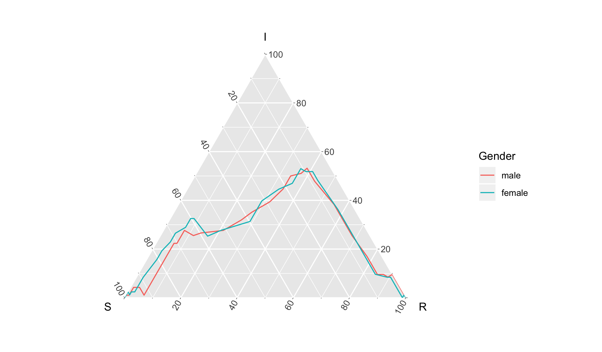

# timeternR

<!-- badges: start -->
[](https://travis-ci.org/shannong19/timeternR)
<!-- badges: end -->

The goal of timeternR is to develop functional based visualization and statistics
that focus on use in ternary plots.

## Installation

You can install the developmental version of timeternR from github using:

```r
# install.package("devtools")
devtools::install_github("shannong19/timeternR")
```

Currently we also need you to download a slightly modified version of `ggtern`, which can be done in the following way (see [Notes on `ggtern` functions](#notes-on-ggtern-functions))

```r
devtools::install_git("https://bitbucket.org/benjaminleroy/ggtern")
```

## Data

   Currently there are three data sets available in `timeternR`

   - `hagelloch_raw` -- One row is an agent.  This is imported from the `surveillance` R package and the variable descriptions are found [here](https://rdrr.io/rforge/surveillance/man/hagelloch.html) where it is originally labeled `hagelloch.df`.  We have renamed it here to help distinguish it from the other data sets we derive from it.
   
   
   - `hagelloch_sir`  -- One row is a state of $(t, s_t, i_t, r_t)$ where $s_t + i_t + r_t = N$ for $t = 0, \dots, T=94$

   - `hagelloch_agents` -- One row is a "sufficient" statistic for each agent's infection.  Each agent's infection is uniquely identified by an initial state, max time before infection (or T), and max time before recovery (or T).  For the states, 0 = S, 1 = I, 2 = R.

  - `U_sims` this is 50 x 3 x 188 array where entry (i,j,k) looks at the ith simulation, the jth statistic, and the kth agent.  The statistics are (inititial state (0/1/2), SMax, IMax)  **Ben: please document - maybe add names for each dimension (see `data_raw/U_sim_tidy.R`).** (**NOT DOCUMENTED**)
  
  - `U_sims_tidy` ("Simulations of Measles outbreaks for Hagelloch, Germany, 1861 (Tidy agent format)"): tidy version of `U_sims` (9400 x 5), each row corresponds to an individual for a single simulation, and contains addtional information on the individual's inital state, and SMax, IMax. (**NOT DOCUMENTED**)


=======


## Notes on `ggtern` functions

The following can nicely make visuals conditional on grouping, on the flip side
it appears to be harder to develop your own stats for `ggtern` ([issue](https://bitbucket.org/nicholasehamilton/ggtern/issues/8/developing-new-stats-and-geoms)).


## Example

```{r}
library(tidyverse)
library(ggtern)
library(timeternR)
hagelloch_raw %>%
   dplyr::filter(SEX %in% c("male", "female")) %>%
   ggplot(aes(y = tI, z = tR, color = SEX)) +
     stat_sir(data_type = "raw") + 
     coord_tern() +
     labs(x = "S", y = "I", z = "R",
          color = "Gender")
```


=======





### Simulate SIR data


```{r}
n_sims <- 100
n_time_steps <- 100
beta <- .1
gamma <- .03
init_SIR <- c(950, 50, 0)
output_format <- "data.frame"
    
out <- simulate_SIR_agents(n_sims = n_sims,
                                 n_time_steps = n_time_steps,
                                 beta = beta, gamma = gamma,
                                 init_SIR = init_SIR,
                                 output_format = output_format)
                                 
df_groups <- out %>% dplyr::group_by(sim) %>%  UtoX_SIR_group                       

# check this error / write a test?

```
