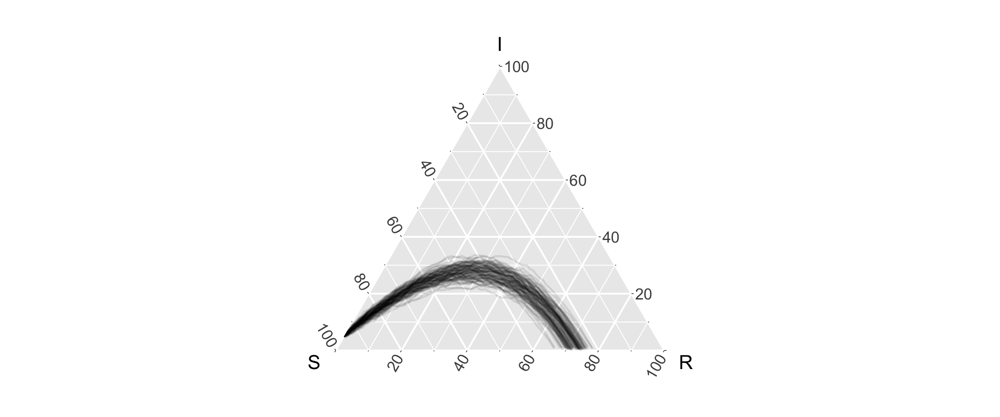

# timeternR

<!-- badges: start -->
[](https://travis-ci.org/shannong19/timeternR)
[](https://codecov.io/gh/shannong19/timeternR)
<!-- badges: end -->

The goal of timeternR is to develop functional based visualization and statistics
that focus on use in ternary plots.

## Installation

You can install the developmental version of timeternR from github using:

```r
# install.package("devtools")
devtools::install_github("shannong19/timeternR")
```

Currently we are also using some helper functions from 2 github based packages, so for before loading our package please do:

```r
# install.package("devtools")
devtools::install_github("Mr8ND/TC-prediction-bands/TCpredictionbands")
devtools::install_github("ngloe/olpsR")
```

## Data

   Currently there are 14 data sets in which to explore the different `timeternR` functions.  These correspond to different sources of raw data along, agent vs. aggregate format, and emphases of different processes such as vital dynamics (e.g. birth and).
   
   Details of each can be found with `?{data}`.
   
  - `agent_sims` this is 50 x 3 x 188 array where entry (i,j,k) looks at the ith simulation, the jth statistic, and the kth agent.  The statistics are (inititial state (0/1/2), SMax, IMax). 
  
  - `agent_sims_tidy` ("Simulations of Measles outbreaks for Hagelloch, Germany, 1861 (Tidy agent format)"): tidy version of `agent_sims` (9400 x 5), each row corresponds to an individual for a single simulation, and contains additional information on the individual's initial state, and SMax, IMax.
  
  
  - `EpiModel_agg_bd` Example output from the `EpiModel package` for an ICM with birth and death rates.  The population $N$ is non-constant.
  
  - `EpiModel_det` output from the `EpiModel` package for a deterministic model (aggregate)
  
  - `EpiModel_icm` Output from the `EpiModel` package for a stochastic ICM (aggregate)
     

  - `hagelloch_agents` -- One row is a "sufficient" statistic for each agent's infection.  Each agent's infection is uniquely identified by an initial state, max time before infection (or T), and max time before recovery (or T).  For the states, 0 = S, 1 = I, 2 = R.
   
  - `hagelloch_aug_births` Like Hagelloch raw but augmented with births (it already had deaths).  Five fake people have been added who join the population over time
   
      

  - `hagelloch_raw` -- One row is an agent.  This is imported from the `surveillance` R package and the variable descriptions are found [here](https://rdrr.io/rforge/surveillance/man/hagelloch.html) where it is originally labeled `hagelloch.df`.  We have renamed it here to help distinguish it from the other data sets we derive from it.
   
  - `hagelloch_raw2` Like Hagelloch raw but with additional, fake people with NA values for `tI` and `tR`
   
   
  - `hagelloch_sir`  -- One row is a state of $(t, s_t, i_t, r_t)$ where $s_t + i_t + r_t = N$ for $t = 0, \dots, T=94$
   
  - `pomp_arr` Example SIR simulation output of class `array` from the `pomp` packagee
  
  - `pomp_df` Example SIR simulation of class `data.frame` from the `pomp` package

  - `pomp_pomp` Example SIR simulation output of class `pomp` from the `pomp` package
  
  - `pomp_sir` Example output from the `pomp` package.

  


## Example

```{r}
library(tidyverse)
library(ggtern)
library(timeternR)
hagelloch_raw %>%
   dplyr::filter(SEX %in% c("male", "female")) %>%
   ggplot(aes(y = tI, z = tR, color = SEX)) +
       stat_sir(data_type = "raw") + 
       coord_tern() +
       labs(x = "S", y = "I", z = "R",
            color = "Gender")
```


### Simulate SIR data


```{r}
n_sims <- 100
n_time_steps <- 100
beta <- .1
gamma <- .03
init_SIR <- c(950, 50, 0)
output_format <- "data.frame"
    
out <- simulate_SIR_agents(n_sims = n_sims,
                           n_time_steps = n_time_steps,
                           beta = beta, gamma = gamma,
                           init_SIR = init_SIR,
                           output_format = output_format)
                                 
df_groups <- out %>% dplyr::group_by(sim) %>%
    agents_to_aggregate_SIR_group  
  
df_groups %>% ggplot(aes(x = S, y = I, z = R, group = sim)) +
    geom_line(alpha = .1) +
    coord_tern()
```



## Notes:
1. For writing code that works with `tidyverse` 1.0 vs `tidyverse` <= 0.8.3 see:
https://tidyr.tidyverse.org/articles/in-packages.html, and for doing both with Travis CI (using a matrix), see https://github.com/tidyverse/design/issues/95
2. For writing your own `geom`s and `stat`s that works with `ggtern` (which are generally restricted), the following 2 stack-exchange articles helped use do so with ease:
    a. https://stackoverflow.com/questions/57175114/ternary-plot-scaling-opacity-across-groups
    b. https://stackoverflow.com/questions/31589479/how-to-fix-no-item-called-packagepkg-on-the-search-list-without-using-libra#comment51172891_31589479
    c. we've also leveraged ideas from https://stat.ethz.ch/pipermail/r-devel/2013-August/067210.html in `R/aaa.R` to overcome messages from CRAN relative to this hack (using `:::`)
  

## Contributors

- Shannon Gallagher ([`skgallagher`](https://github.com/skgallagher))
- Benjamin LeRoy ([`benjaminleroy`](https://github.com/benjaminleroy))


