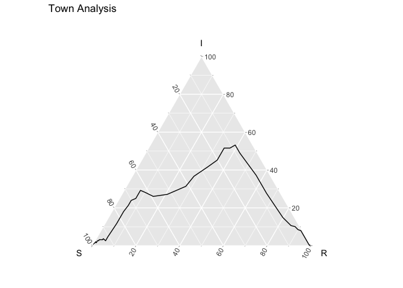
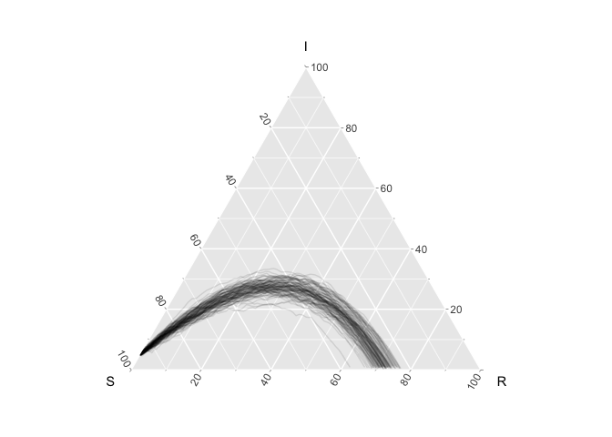
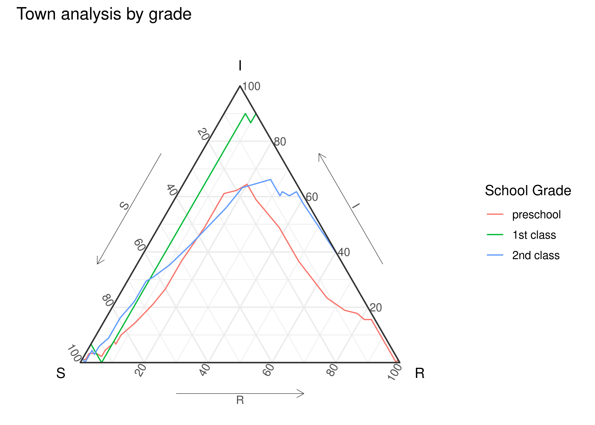

<!-- README.md is generated from README.Rmd. Please edit that file -->
EpiCompare 
==============================================================================

<!-- badges: start -->
[](https://travis-ci.org/skgallagher/EpiCompare) [](https://codecov.io/gh/skgallagher/EpiCompare) <!-- badges: end -->

The goal of timeternR is to develop functional based visualization and statistics that focus on use in ternary plots.

Installation
------------

You can install the developmental version of timeternR from github using:

``` r
# install.packages("devtools")
devtools::install_github("skgallagher/timeternR")
```

Data
----

Currently there are 13 data sets in which to explore the different `timeternR` functions. These correspond to different sources of raw data along, agent vs. aggregate format, and emphases of different processes such as vital dynamics (e.g. birth and).

Details of each can be found with `?{data}`.

-   `agent_sims` this is 50 x 3 x 188 array where entry (i,j,k) looks at the ith simulation, the jth statistic, and the kth agent. The statistics are (inititial state (0/1/2), SMax, IMax).

-   `agent_sims_tidy` ("Simulations of Measles outbreaks for Hagelloch, Germany, 1861 (Tidy agent format)"): tidy version of `agent_sims` (9400 x 5), each row corresponds to an individual for a single simulation, and contains additional information on the individual's initial state, and SMax, IMax.

-   `EpiModel_agg_bd` Example output from the `EpiModel package` for an ICM with birth and death rates. The population *N* is non-constant.

-   `EpiModel_det` output from the `EpiModel` package for a deterministic model (aggregate)

-   `EpiModel_icm` Output from the `EpiModel` package for a stochastic ICM (aggregate)

-   `hagelloch_agents` -- One row is a "sufficient" statistic for each agent's infection. Each agent's infection is uniquely identified by an initial state, max time before infection (or T), and max time before recovery (or T). For the states, 0 = S, 1 = I, 2 = R.

-   `hagelloch_aug_births` Like Hagelloch raw but augmented with births (it already had deaths). Five fake people have been added who join the population over time

-   `hagelloch_raw` -- One row is an agent. This is imported from the `surveillance` R package and the variable descriptions are found [here](https://rdrr.io/rforge/surveillance/man/hagelloch.html) where it is originally labeled `hagelloch.df`. We have renamed it here to help distinguish it from the other data sets we derive from it.

-   `hagelloch_raw2` Like Hagelloch raw but with additional, fake people with NA values for `tI` and `tR`

-   `hagelloch_sir` -- One row is a state of (*t*, *s*<sub>*t*</sub>, *i*<sub>*t*</sub>, *r*<sub>*t*</sub>) where *s*<sub>*t*</sub> + *i*<sub>*t*</sub> + *r*<sub>*t*</sub> = *N* for *t* = 0, …, *T* = 94

-   `pomp_arr` Example SIR simulation output of class `array` from the `pomp` packagee

-   `pomp_df` Example SIR simulation of class `data.frame` from the `pomp` package

-   `pomp_pomp` Example SIR simulation output of class `pomp` from the `pomp` package

-   `pomp_sir` Example output from the `pomp` package.

Example
-------

``` r
library(tidyverse)
library(ggtern)
library(timeternR)
```

The following example comes from a Measles outbreak in Hagelloch, Germany in 1861. We have data on each child (agent) in the town.

``` r
hagelloch_raw %>%
  ggplot(aes(y = tI, z = tR)) +
    geom_aggregate() + 
    coord_tern() +
    labs(x = "S", y = "I", z = "R", title = "Town Analysis")
```



Previous work has suggested that the class (`CL`) the student was in effected how the experienced the outbreak. The below figure shows differences in the outbreak relative to this grouping.

``` r
hagelloch_raw %>% 
  rename(`school grade` = CL) %>%
  group_by(`school grade`) %>%
  summarize(`number of students` = n())
#> # A tibble: 3 x 2
#>   `school grade` `number of students`
#>   <fct>                         <int>
#> 1 preschool                        90
#> 2 1st class                        30
#> 3 2nd class                        68

hagelloch_raw %>%
   ggplot(aes(y = tI, z = tR, color = CL)) +
       geom_aggregate() + 
       coord_tern() +
       labs(x = "S", y = "I", z = "R",
            color = "School Grade",
            title = "Town analysis by grade") 
```



### Simulate SIR data

``` r
n_sims <- 100
n_time_steps <- 100
beta <- .1
gamma <- .03
init_SIR <- c(950, 50, 0)
    
out <- simulate_SIR_agents(n_sims = n_sims,
                           n_time_steps = n_time_steps,
                           beta = beta, gamma = gamma,
                           init_SIR = init_SIR)
                                 
df_groups <- out %>% dplyr::group_by(sim) %>%
    agents_to_aggregate(states = c(tI, tR)) %>%
    rename(S = X0, I = X1, R = X2)
  
df_groups %>% ggplot() +
    geom_prediction_band(aes(x = S, y = I, z = R, sim_group = as.numeric(sim)),
                         alpha = .2, fill = "blue", color = "blue") +
    geom_line(aes(x = S, y = I, z = R, group = sim), alpha = .1) +
    coord_tern()
#> Warning: Ignoring unknown aesthetics: z
```



Notes:
------

1.  For writing code that works with `tidyverse` 1.0 vs `tidyverse` &lt;= 0.8.3. We followed ideas found in [tidyr: in-packages](https://tidyr.tidyverse.org/articles/in-packages.html), for the code, and - when working with Travis CI (using a matrix for multiple builds) - we leverage ideas in [tidyverse travis on github](https://github.com/tidyverse/design/issues/95) and [tidyverse principles](https://principles.tidyverse.org/changes-multivers.html).
2.  For writing your own `geom`s and `stat`s that works with `ggtern` (which are generally restricted), the following 2 stack-exchange articles helped use do so with ease:
    1.  [stack-exchange: personal code idea](https://stackoverflow.com/questions/57175114/ternary-plot-scaling-opacity-across-groups)
    2.  [stack-exchange: being able to access ggtern's element write away](https://stackoverflow.com/questions/31589479/how-to-fix-no-item-called-packagepkg-on-the-search-list-without-using-libra#comment51172891_31589479)
    3.  Finally, we've also leveraged ideas from [R-devel: on avoiding problems with `:::`](https://stat.ethz.ch/pipermail/r-devel/2013-August/067210.html) in `R/aaa.R` to overcome messages from CRAN relative to this hack (using `:::`). For some reason - when documenting for `pkgdown` website, we need to do `library(ggtern); timeternR:::update_approved_layers()`
3.  `geom_prediction_band` required not just `compute_group` but `compute_layer` - there is very little documentation on how to approach this correctly. Basically - there are problems when the `compute_group` wants to make multiple `pieces`/`groups` - and it is similar to the problem that if you do something like `aes(color= var1, group =var2)` you may actually want to do `aes(color= var1, group =paste(var1, var2)`, if there are the same `var2` values across different `var1` values but they don't mean they should be grouped together.

Contributors
------------

-   Shannon Gallagher ([`skgallagher`](https://github.com/skgallagher))
-   Benjamin LeRoy ([`benjaminleroy`](https://github.com/benjaminleroy))
