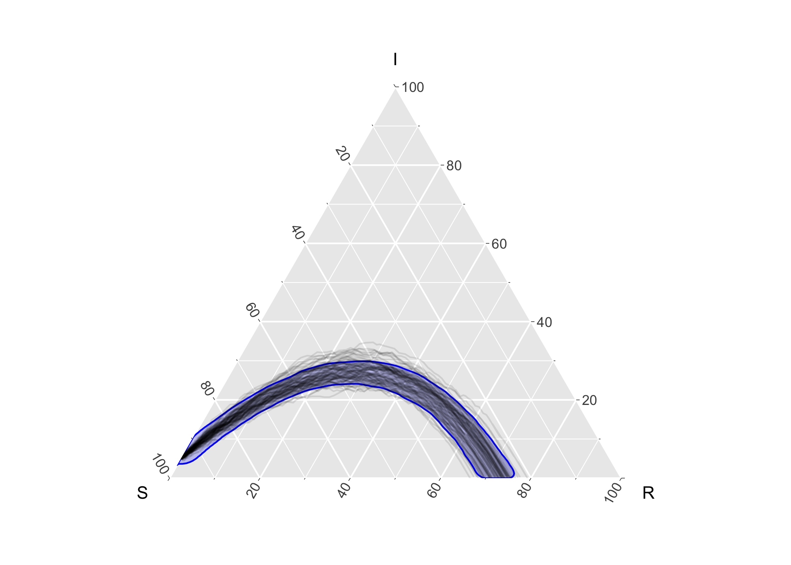

<!-- README.md is generated from README.Rmd. Please edit that file -->
EpiCompare <a href = "https://skgallagher.github.io/EpiCompare/"></a>
========================================================================================================================================

<!-- badges: start -->
[](https://travis-ci.org/skgallagher/EpiCompare) [](https://codecov.io/gh/skgallagher/EpiCompare) <!-- badges: end -->

The goal of EpiCompare is to develop functional based visualization and statistics that focus on use in ternary plots.

Installation
------------

You can install the developmental version of EpiCompare from github using:

``` r
# install.packages("devtools")
devtools::install_github("skgallagher/EpiCompare")
```

Data
----

Description of data including in this package can be found in the data section of the [reference](https://skgallagher.github.io/EpiCompare/reference/index.html#section-data) page of the documentation website.

Example
-------

``` r
library(tidyr)
library(ggplot2)
library(dplyr)
library(ggtern)
library(EpiCompare)
```

The following example comes from a Measles outbreak in Hagelloch, Germany in 1861. We have data on each child (agent) in the town.

``` r
hagelloch_raw %>%
  ggplot(aes(y = tI, z = tR)) +
    geom_aggregate() + 
    coord_tern() +
    labs(x = "S", y = "I", z = "R", title = "Town Analysis")
```


Previous work has suggested that the class (`CL`) the student was in effected how the experienced the outbreak. The below figure shows differences in the outbreak relative to this grouping.

``` r
hagelloch_raw %>% 
  rename(`school grade` = CL) %>%
  group_by(`school grade`) %>%
  summarize(`number of students` = n())
#> # A tibble: 3 x 2
#>   `school grade` `number of students`
#>   <fct>                         <int>
#> 1 preschool                        90
#> 2 1st class                        30
#> 3 2nd class                        68

hagelloch_raw %>%
   ggplot(aes(y = tI, z = tR, color = CL)) +
       geom_aggregate() + 
       coord_tern() +
       labs(x = "S", y = "I", z = "R",
            color = "School Grade",
            title = "Town analysis by grade") 
```


### Simulate SIR data

``` r
n_sims <- 100
n_time_steps <- 100
beta <- .1
gamma <- .03
init_SIR <- c(950, 50, 0)
    
out <- simulate_SIR_agents(n_sims = n_sims,
                           n_time_steps = n_time_steps,
                           beta = beta, gamma = gamma,
                           init_SIR = init_SIR)
                                 
df_groups <- out %>% dplyr::group_by(sim) %>%
    agents_to_aggregate(states = c(tI, tR)) %>%
    rename(S = X0, I = X1, R = X2)
  
df_groups %>% ggplot() +
    geom_prediction_band(aes(x = S, y = I, z = R, sim_group = as.numeric(sim)),
                         alpha = .2, fill = "blue", color = "blue") +
    geom_line(aes(x = S, y = I, z = R, group = sim), alpha = .1) +
    coord_tern()
#> Warning: Ignoring unknown aesthetics: z
```



Package Creation Notes:
-----------------------

1.  For writing code that works with `tidyverse` 1.0 vs `tidyverse` &lt;= 0.8.3. We followed ideas found in [tidyr: in-packages](https://tidyr.tidyverse.org/articles/in-packages.html), for the code, and - when working with Travis CI (using a matrix for multiple builds) - we leverage ideas in [tidyverse travis on github](https://github.com/tidyverse/design/issues/95) and [tidyverse principles](https://principles.tidyverse.org/changes-multivers.html).
2.  For writing your own `geom`s and `stat`s that works with `ggtern` (which are generally restricted), the following 2 stack-exchange articles helped use do so with ease:
    1.  [stack-exchange: personal code idea](https://stackoverflow.com/questions/57175114/ternary-plot-scaling-opacity-across-groups)
    2.  [stack-exchange: being able to access ggtern's element write away](https://stackoverflow.com/questions/31589479/how-to-fix-no-item-called-packagepkg-on-the-search-list-without-using-libra#comment51172891_31589479)

    3.  Finally, we've also leveraged ideas from [R-devel: on avoiding problems with `:::`](https://stat.ethz.ch/pipermail/r-devel/2013-August/067210.html) in `R/aaa.R` to overcome messages from CRAN relative to this hack (using `:::`). For some reason - when documenting for `pkgdown` website, we need to do `library(ggtern); EpiCompare:::update_approved_layers()`

3.  `geom_prediction_band` required not just `compute_group` but `compute_layer` - there is very little documentation on how to approach this correctly. Basically - there are problems when the `compute_group` wants to make multiple `pieces`/`groups` - and it is similar to the problem that if you do something like `aes(color= var1, group =var2)` you may actually want to do `aes(color= var1, group =paste(var1, var2)`, if there are the same `var2` values across different `var1` values but they don't mean they should be grouped together.

4.  I (`skgallagher`) had problems with tidy evaluation with `fortify_aggregate`, specifically when one method called another method. To get around this, I used a hack to introducing a new argument which would only ever be `NULL` or an object of class `quosure`. Thus the outer methods that called inner methods passed quosures. See code in `fortify-aggregate-list.R` e.g..

Contributors
------------

-   Shannon Gallagher ([`skgallagher`](https://github.com/skgallagher))
-   Benjamin LeRoy ([`benjaminleroy`](https://github.com/benjaminleroy))
