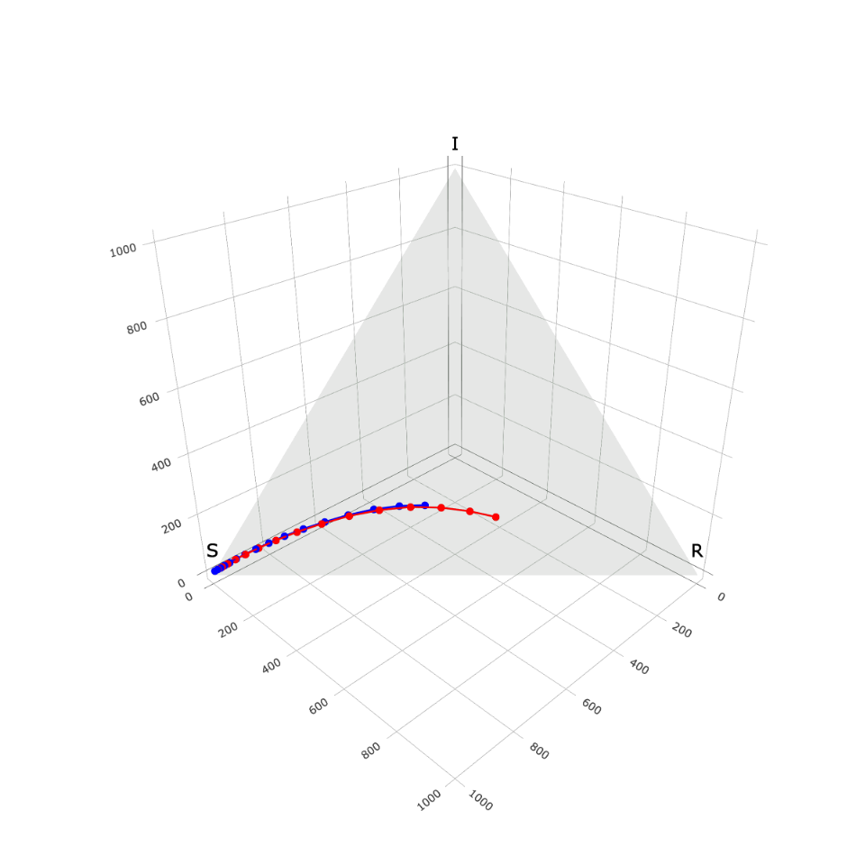

```{r, setup, include=FALSE}
options(prompt = 'R> ', continue = '+ ')
options(kableExtra.latex.load_packages = FALSE)


knitr::opts_chunk$set(fig.width=12, fig.height=8, fig.path='Figs/',
                      fig.align = "center",
                      echo=TRUE, warning=FALSE, message=FALSE,
                      fig.pos = "H",
                      cache = TRUE)

devtools::load_all("../../")

```

\newcommand{\shannon}[1]{\textcolor{orange}{#1}}
\newcommand{\shan}[1]{\textcolor{brown}{#1}}
\newcommand{\ben}[1]{\textcolor{violet}{#1}}

\newtheorem{theorem}{Theorem}


# Introduction {short-title="Intro" #sec:intro}

The recent (and on-going) COVID-19 global pandemic has galvanized public interest in understanding more about infectious disease modeling and has highlighted the usefulness of research in the area of infectious disease epidemiology. Infectious diseases inflict enormous burdens on the world: millions of lives lost and trillions of dollars spent yearly. Infectious disease models typically attempt to do one or more of the following: 1) predict the spread of current and future epidemics \citep[e.g. flu prediction][]{Biggerstaff2016}, 2) analyze past and current epidemics to increase scientific knowledge \citep[e.g. historical measle outbreaks][]{Neal2004}, and 3) forecast or project epidemic scenarios under pre-specified parameters \citep[e.g.][]{ferguson2020}. At the same time, descriptive statistics and visualizations from universities, many branches and levels of government, and news organizations  are an important first step of the process \ben{as has been seen in the current COVID-19 epidemic}\citep{dong2020,cdc-covid-tracker2021,wp-covid-tracker2021}. \footnote{\ben{[Ben says: probably should have a conclusion sentence here - seems to end abruptly. *This is less so the case now.]}}

With the many visualization and exploratory tools, models and modeling paradigms, and reviews and comparisons in the literature and through the MIDAS (Models of Infectious Disease Agent Study) network \citep{midasnetwork2021}, this field has a lot of devices to aid an individual practitioner decide the correct approach.  For example, \proglang{R} packages such as \pkg{surveillance}, \pkg{EpiModel}, and \pkg{pomp} have all made significant steps in standardizing the flow of the data analysis pipeline for epidemic modeling through digitizing data sets, making accessible statistical models, and providing a plethora of educational material for both coding novices and experts alike \citep{surveillance2017,Jenness2018,King2016}.

At the same time, analysis packages often only address a specific portion of the analysis pipeline\ben{\sout{, for instance focusing on certain types of models.}} \ben{These m}odeling tools\ben{\sout{, which}} usually require learning package-specific syntax\ben{\sout{,}} and often don't provide easy ways to compare and assess their models on new data. Moreover, exploring\ben{, \sout{and}} modeling \ben{and comparing} epidemics require transforming and \textit{tidying} data in different ways. To fill these gaps, we present our \proglang{R} package \pkg{EpiCompare}. Our package's primary focus is to aid and advance research in the area of comparison and assessment of epidemic and epidemiological models. In Figure \ref{fig:pipeline}, we illustrate the data analysis pipeline of infectious diseases  as 1) data pre-processing, 2) exploratory data analysis (EDA), 3) modeling and simulating, 4) post-processing, and 5) comparison and assessment; where each previous part of the pipeline influences the next. \pkg{EpiCompare} provides tools to aids practitioners in all areas of this pipeline.


<!-- # old draft
The recent (and currently on-going) COVID-19 global pandemic has galvanized public interest in understanding more about infectious disease modeling and has highlighted the usefulness of research in the area of infectious disease epidemiology. Infectious disease models typically attempt to do one or more of the following: 1) predict the spread of current and future epidemics \citep[e.g. flue prediction][]{Biggerstaff2016}, 2) analyze past and current epidemics to increase scientific knowledge \citep[e.g. historical measle outbreaks][]{Neal2004}, and 3) forecast or project epidemic scenarios under pre-specified parameters \citep[e.g. ...][]{}. The COVID-19 pandemic highlights how all three goals are important both separately and taken as a whole.  Infectious diseases inflict enormous burdens on the world: millions of lives lost and trillions of dollars spent yearly.  Correctly analyzing and addressing these issues aids in prevention and mitigation of future outbreaks. \shannon{really like this paragraph}


The current epidemic of COVID-19 also highlights that infectious disease  models are only one piece of the overall analysis pipeline. University based resources like John Hopkins' and government numerical dashboards (across all levels of government) during the COVID-19 epidemic remind us that descriptive statistics and visualization can be a important first step in the process (multiple \cite{}?).} \shannon{add comment about NYT or something} Still, rightly so, a large amount of theoretical work goes into modeling epidemics, with different models focusing at the individual / agent level, network structure or just aggregate flows (review paper \cite{}?). All placing individuals / proportions of the populations into different states (e.g. suspectible, exposed, infected, recovered, etc.). With all these models, review and comparison papers in the literature and through MIDAS (Models of Infectious Disease Agent Study) Control Center helps the individual practitioner decide the correct approach. \shannon{along with expertise from healthcare professionals...}

At the same time, analysis packages often only address a portion of the analysis pipeline. Modeling tools often don't provide easy ways to compare and assess their models on new data. Moreover, exploring and modeling epidemics require transforming and \textit{tidying} data in different ways. To fill these gaps, we present our our \proglang{R} package \pkg{EpiCompare}. Our package's primary focus is to aid and advance research in the area of comparison and assessment of epidemic \& epidemiological models. In Figure \ref{fig:pipeline}, we illustrate the data analysis pipeline of infectious diseases  as 1) data pre-processing, 2) exploratory data analysis (EDA), 3) modeling and simulating, 4) post-processing, and 5) comparison and assessment; where each previous part of the pipeline influences the next. \pkg{EpiCompare} provides tools to aids practitioners in all areas of this pipeline. 
-->

\begin{figure}[!ht]
    \centering
    \includegraphics[width = 1\textwidth]{images/pipeline1.png}
    \caption{An idealized epidemiological data analysis pipeline.}
    \label{fig:pipeline}
\end{figure}

\pkg{EpiCompare} also emphasizes the value of analyzing epidemics in a \textit{time-invariant} way. Epidemics, despite by definition being a process that evolves over time, often need to be compared in a way not constrained to initial times or time scales to understand the processes at play. 
<!-- Additionally, many tools designed to examine the quantity of the population in each epidemic state (for example: quantity of Susceptible vs Infectious vs Recovered individuals) don't always as intelligently capture the natural connections between the proportion of individuals in these states. \shannon{I don't quite understand this.  Is this because of underreporting?  If so I'm not sure how EpiCompare helps us here.} -->
\ben{Time-invariant analysis can also make it easier to compare state-space models in a more global, holistic fashion. \sout{Moreover, m} M}any current \ben{time-dependent} comparison tools for state-space models (e.g. SIR models) \ben{\sout{highlight} examine} the proportion of individuals in each state (at a given time) in a piece-wise / marginal  fashion. \ben{These \sout{This}} approach\ben{es} may reduce the amount of connections that can be seen, similar to projections of a multidimensional distribution onto a single axis at a time. Tools in \pkg{EpiCompare} give the user the ability to extend their toolkit to evaluate epidemics within a time-invariant lens. The goal of \pkg{EpiCompare} is not to supplant existing infectious disease modeling tools and software but, rather, is a concerted effort to create standard and fair comparisons among models developed for disease outbreaks and outbreak data.

This paper is broken up into the following sections; section \ref{sec:time-invariant} motivates and showcases tools of time-invariant analysis,  section \ref{sec:overview} presents an outline of how \pkg{EpiCompare} aids a practitioner in every step of the pipeline and section \ref{sec:tour} provides a \ben{\sout{thorough}} demonstrating of the tools through a detailed example of a full data analysis pipeline.


# Motivation and tools for time-invariant analysis {short-title="Time-invariant" #sec:time-invariant}

<!-- \shannon{time invariance vs. time invariant analysis??} -->

<!-- \shannon{I again changed this section a lot, but hopefully it's more in line with what you are thinking.  The story I want to tell is 1) introduce the concept of time invariance; 2) demonstrate time invariance through R0 and tell why it is important; 3) visualize R0 from the SIR model with a time-invariant plot\footnote{\ben{[Ben says: defend how this fits into the narrative?]}} and 4) talk }\ben{Time invariance in} \sout{about}\shannon{ models beyond SIR.} -->

<!-- \shannon{I noticed the ternary plot kinda fell out of this section and it's not really detailed anywhere else in the paper.  So I put it back in.  It's a non-standard plot and a feature of EpiCompare so I think it's worth talking about, and I think it's appropriate to introduce in this section.} -->

<!--Epidemics can be difficult to compare to one another due to differences in diseases, locations, or population behaviors, or times.  In \pkg{EpiCompare}, we emphasize comparisons between epidemics adjusting for the last component, time.  Time-invariant analysis is beneficial because by adjusting for the unit of infection rate, we can focus on the "lifetime" of an epidemic, a view that is concerned more with the number of lives affected than as opposed to any specific time constraint.    Time-invariant analysis is also beneficial when there are gaps in time between occurrences of outbreaks of a similar nature in different geographic regions.  Finally, time-invariant analysis is beneficial because many studies talk about a period of ``exponential growth'' of the number of outbreaks \citep{chowell2007,wallinga2007generation,forsberg2008}.

Time-invariant analysis, as it appears in \pkg{EpiCompare} solves the above issues by observing functionals which attempt to capture the general shape of the epidemic with respect to the proportion of the population in each epidemic state.  This allows us to compare scenarios as different as, for instance as a decades-long outbreak HIV in the US compared to a 10 day outbreak of norovirus on a cruise ship.  Moreover, this tool avoids the need for choosing a 'beginning' $t_0$ or 'end' $t_F$ of an epidemic, choices \cite{gallagher2020} show that can heavily influence, for example,  estimates of peak infection height or the reproduction number $R_0$.
-->

\pkg{EpiCompare} delivers \textit{time-invariant} analysis by (1) taking a global, not marginal view of how epidemics move through populations and (2) by treating full epidemics as filamental trajectories. The following section aims to highlight the strengths of \textit{time-invariant} \shannon{analysis} and define the mathematical foundations that \pkg{EpiCompare}’s tools stand upon.

Mathematically, epidemics are complex objects.  They can be hard to assess and compare to one another due to the differences in the diseases, the location where the outbreak occurs,  how the affected population reacts, and the time \sout{related}\shannon{related} features (including start of the epidemic, speed of infection and more). Time-invariant analysis makes different epidemics easier to compare by removing many time dependent aspects of an epidemic. \sout{Instead,} \shannon{Time-invariant analysis} focuses \shannon{on the global pattern of an epidemic, via filamental trajectories,  and emphasizes the number of lives affected.} \ben{[Ben wants to try this sentence again.]}

## Motivating time-invariant analysis through the reproduction number $R_0$ {short-title="motivating through R0" #sec:r0}

Time-invariant analysis, as it appears in \pkg{EpiCompare}, \shannon{bypasses} many difficulties \shannon{in} comparing different epidemics. With time-invariant analysis, comparing the decades-long outbreak of HIV in the US to a 10 day outbreak of norovirus on a cruise ship is \sout{still} possible. Time-dependent problems can arise when estimating epidemiological parameters, including the reproduction number $R_0$. \sout{\ben{We will use $R_0$ to motivate the usefulness of time-invariant analysis in this section.}}^[\shannon{I don't think this is a necessary sentence.} \ben{I still think it adds value to the story and I'm not sure people really read section titles that are long.}]


<!-- \ben{ -->
<!-- Story:  -->
<!-- (1) basic definition of $R_0$, (2) emphasis that $R_0$ captures a lot of information about an epidemic. Given 3 number example and discuss how one would usually interpret what the differences in $R_0$ meant (3) maybe connect to \# of $R_0$ estimates for COVID-19 (Aronson et al 2020).  -->
<!-- } -->

$R_0$ is probably the most famous \sout{time-invariant} numerical summary of an epidemic and is often associated with the Susceptible-Infectious-Recovered (SIR) model \citep{hethcote2000}.  $R_0$ is \sout{a one-number summary of a disease and is }defined as the expected number of infections caused by a single infector who is added to a completely susceptible population \citep{anderson1992}. \ben{This \shannon{definition has no mention of time and hence} means that $R_0$ is a time-invariant parameter\shannon{. Yet $R_0$ is} estimated with time-\sout{based}\shannon{dependent} data, which can make it a difficult quantity to estimate.} \shannon{For example, \cite{Gallagher2020} demonstrate how $R_0$ can be sensitive to time-\sout{based}\shannon{dependent} parameters such as the beginning and end of an epidemic, two quantities that generally are}\ben{hard to define precisely.\sout{do not have precise definitions}}. To demonstrate the difficulty of discerning $R_0$ in \ben{\sout{a}other}\footnote{\ben{I change this so we don't confused readers that we're going show the impact in tools beyond just the estimation itself.}} time-dependent analysis, we first introduce \citet{Kermack1927}’s SIR model. This model captures the transitions from one state to the next as a system of ordinary differential equations, where $N$ is the total number of individuals, $\beta$ is the rate of infection, and $\gamma$ is the rate of recovery,


\begin{align}\label{eq:sir-ode}
    S^\prime(t) &= -\frac{\beta S(t)I(t)}{N} \\
    I^\prime(t) &= \frac{\beta S(t)I(t)}{N} - \gamma I(t) \nonumber\\
    R^\prime(t) &= \gamma I(t) \nonumber.
\end{align}

From this model,\shannon{the reproduction number is the ratio of the infection rate to the recovery rate,} $R_0 = \beta/\gamma$\sout{, aka the ratio of the infection rate compared to the recovery rate.} \ben{From this definition, given 
\sout{Since}} $\beta$ and $\gamma$ are both rates, \ben{it should be clear that} the ratio of the two, $R_0$, is a time-invariant quantity.\footnote{\ben{I am trying to make it look like we are not repeating ourselves by saying $R_0$ is time-invariant.}} \sout{ Once $R_0$ is estimated, practitioners can infer important epidemic quantities such as the total number of infections or the percent of a population needed to be vacccinated to stop the sustained spread of an epidemic.  Moreover, $R_0$ allows us to compare different diseases and different instances of outbreaks on the same scale. }^[cool facts about r0, but not the central point] 


\ben{[Ben says: It's unclear to me why we have a subtitle here - isn't it just more motivation of time-invariant anlysis with $R_0$? Also, I feel like the story is weak here. The point is to leverage $R_0$ to show the value of time-invariant analysis - this seems a bit more like just discussing properties of $R_0$. In the follow rewrite I use "[" and "]" to indicate that this is a section from your earlier draft.]}
\shannon{[Shannon says: Tried to tie this better to the previous part since it's no longer a new section.  also highlighted tie to time-invariant analysis and $R_0$.  I also wanted to bring the punch line (overlapping epidemics = same r0) closer to the beginning so those who don't want to slog through mathematical details can get the takeaway.]}\shannon{ Shannon tries again in \textcolor{blue}{blue}}


\sout{\ben{[Ben says: this paragraph needs to still be looked at. Also I'm not sure why this particular paragraph was changed so much at all. Currentlly, the way we present comparing these epidemic's $R_0$s isn't well grouped/motivated.]} \shannon{Time-invariant analysis helps practitioners to more easily compare $R_0$ from different outbreaks.} For example, consider two epidemics generated from the Kermack and McKendrick SIR equations. The first epidemic has parameters $\beta_1, \gamma_1 = (0.8,0.4)$ and the second has $\beta_2, \gamma_2 = (0.64,0.32)$.  Both epidemics have populations of 1000 people with 10 individuals initially infected.  Additionally note that the two reproduction numbers are the same for each epidemic, $R_0 = 2=0.8/0.4 = 0.64/0.32$.  We plot the epidemics with traditional $state$ vs. $time$ plots}\footnote{This sentecne is out of place / doesn't connect with the other sentences.}. \sout{In Fig. \ref{fig:different-scales-standard} we show the time-based paths for the $S$, $I$, and $R$ states for the first 15 days of observed data.  In this time-variant view, we may believe that \ben{epidemic} 1 has a larger $R_0$ than \ben{epidemic} 2 because the peak of infection occurs more quickly than in Epidemic 2.  On the other hand, we may believe \ben{epidemic} 2 has a larger $R_0$ because its unclear if the  number of infections in that \ben{epidemic} has not yet peaked at time 15.  In this time-variant view, we cannot determine if one epidemic has larger value of $R_0$}\footnote{\ben{This sentnce doesn't connect wit previous examples.}}.


\textcolor{blue}{Since $R_0$ is an important value, it would be helpful to have more intuitive ways of comparing one $R_0$ to another.  Usually numerical summaries of $R_0$ are presented, which while overall very helpful, may be confusing when presented along side epidemic data that are visualized in a traditional, time-dependent manner.}

\textcolor{blue}{For example, consider two epidemics generated from the Kermack and McKendrick SIR equations where both have the same value of $R_0$. The first epidemic has parameters $\beta_1, \gamma_1 = (0.8,0.4)$ and the second has $\beta_2, \gamma_2 = (0.64,0.32)$.  Both epidemics have populations of 1000 people with 10 individuals initially infected. An analysis may present an estimate of $\hat{R}_0 = 2$ alongside state vs. time plots like those shown in Figure \ref{fig:different-scales-standard}. The paths of the epidemics in the state vs. time view seem to differ from one another including having different infection peaks. From these traditional time-based plots, there is no intuitive way to conclude that these two epidemics have the same value of $R_0$.}


```{r echo = FALSE}
devtools::load_all()
library(tidyr)
library(dplyr)
library(knitr)
library(kableExtra)
library(ggplot2)
set.seed(1)

theme_set(theme_bw(base_size = 24))
```


```{r echo = FALSE, fig.cap = "\\label{fig:different-scales-standard}Example of two epidemics with different $\\beta$ and $\\gamma$ paremeters but the same initial reproduction number $R_0$ = 2.  Both epidemics are generated from models with $N= 1000$ individuals with $S(0) = 990$ and $I(0) = 10$."  }
set.seed(1225)
theme_set(theme_bw(base_size = 24))

beta1 <- .8
gamma1 <- .4
scale <- .8
sir1 <- simulate_SIR_agents(n_sims = 100, n_time_steps = 40,
                            beta = beta1, gamma = gamma1,
                            init_SIR = c(990, 10, 0)) %>%
  group_by(sim) %>%
  agents_to_aggregate(states = c(tI, tR)) %>%
  group_by(t) %>%
  summarize(S = mean(X0), I = mean(X1), R = mean(X2),
            .groups = "drop") %>%
  mutate(type = "Epidemic 1")

sir2 <- simulate_SIR_agents(n_sims = 100, n_time_steps = 40,
                            beta = beta1 * scale, gamma = gamma1 * scale,
                            init_SIR = c(990, 10, 0)) %>%
  group_by(sim) %>%
    agents_to_aggregate(states = c(tI, tR)) %>%
  group_by(t) %>%
  summarize(S = mean(X0), I = mean(X1), R = mean(X2),
            .groups = "drop") %>%
  mutate(type = "Epidemic 2")

df <- bind_rows(sir1, sir2)

df_long <- df %>%
         tidyr::pivot_longer(cols = c(S, I, R))  %>%
  mutate(name = factor(name, levels = c("S", "I", "R"))) %>%
  filter(t <= 15)

ggplot(data = df_long,
       aes(x = t, y = value, col = type)) + 
  facet_wrap(~name, ncol = 1, scales = "free") +
  geom_line() +
  geom_point() +
  scale_color_manual(values = c("red", "blue"), name = "Epidemic") +
  labs(x = "Time",
       y = "# in state",
       title = latex2exp::TeX("Comparing two epidemics over first 15 days with same $R_0$")) +
  coord_cartesian(xlim = c(0, 15))
```


\textcolor{blue}{\pkg{EpiCompare} provides a time-invariant tool to visualize these epidemics in a more intuitive manner, at least in regards to comparing values of $R_0$.} \sout{A time-invariant approach to visualizing epidemics, in comparison, allows us to directly compare $R_0$ from a single plot.}  \ben{For every time \sout{point} $t$ we have a \shannon{point} $(S(t),I(t), R(t))$\sout{, so we can treat epidemics as a trajectory in this three-dimensional space, as we visual in the left subplot of Figure \ref{fig:different-sacles-tern}.} \shannon{so we can visualize the trajectory of the epidemic in three-dimensional space (see Fig. \ref{fig:different-scales-tern} (left)).} For state space models like in our example, given the constraint that $S(t) + I(t)+R(t)$ is always equal to $N$ (the total population size), we can visual these point in a a two-dimesional \textit{ternary} plot, as seen in Figure \ref{fig:different-scales-tern} (right). \sout{In Fig. \ref{fig:different-scales-tern}
we plot the filamental trajectories of the two epidemics in a time-invariant view. We will explain how and why this works shortly. The important takeaway is that in this time-invariant view, i}I}t is apparent that these epidemics are on "the same path." In this case, this indicates that two epidemics have the same value of $R_0$.


```{r warning = FALSE, message = FALSE, echo = FALSE, fig.cap = "\\label{fig:different-scales-tern}Left: trajectory of epidemic in three-dimensional space, plotting $(S(t), I(t), R(t))$.  Right: the gray-shaded region and epidemic trajectory shown from (left) now shown in two-dimensional space.  This is more commonly known as a ternary plot.", fig.show="hold", out.width="49%"}
tern_vis <- ggplot(data = df %>%
         filter(t <= 15)) +
  geom_path(aes(x = S, y = I, z = R,
                     col = type)) +
  geom_point(aes(x = S, y = I, z = R,
                     col = type)) +
    coord_tern() + 
  theme_sir() +
  scale_color_manual(values = c("red", "blue"), name = "Epidemic") 

df_tri <- data.frame(t = 0:3,
                     S = c(1,0,0,1)*1000,
                     I = c(0,1,0,0)*1000,
                     R = c(0,0,1,0)*1000,
                     name = c("S", "I", "R", "S"),
                     type = "border") %>% 
  mutate(type = as.character(type))
df2 <- df %>% filter(t <= 15) #%>%
  #mutate(N = S+I+R,
  #      S = S/N,
  #      I = I/N,
  #      R = R/N) %>%
  #select(-N) 

if (F){
  plotly_vis <- df2 %>% 
    plotly::plot_ly(x = ~S, y = ~R, z = ~I, color = ~type) %>%
    plotly::add_trace(type = 'scatter3d', mode = "lines+markers",
                      marker = list(size = 5),
                      line = list(width = 4)) %>%
    plotly::add_trace(data = df_tri, 
                      x = ~S, 
                      y = ~R,
                      z = ~I,
                      type = "mesh3d", color = I("blue"), opacity = .1) %>%
    plotly::add_text(data = df_tri[1:3,], 
                      x = ~S, 
                      y = ~R,
                      z = ~I, 
                     text= ~name, color = I("black"), textfont = list(size = 20)) %>%
    plotly::layout(scene = list(
        camera = list(eye = list(x = 1.5, y = 1.5, z = 1.2)),
        aspectratio = list(x = 1, y = 1, z = 1),
        xaxis = list(title = ""),
        yaxis = list(title = ""),
        zaxis = list(title = "")),
        showlegend = FALSE)
    #plotly::add_surface(data = df_tri, x = ~S, y = ~I, z = ~R, color = ~type) 
  
  Sys.setenv("PATH" = paste(Sys.getenv("PATH"), 
                            "/Users/benjaminleroy/miniconda3/bin", 
                            sep = .Platform$path.sep))
  plotly::orca(plotly_vis, file = "images/vis3d.png",width = 8 * 120, height = 8 * 120)
} 


plot(tern_vis)
```


\ben{Underlying our time-invariant visualization that allowed for the comparison of $R_0$ in Fig. \ref{fig:different-scales-tern} is the treatment of the epidemic as a single filamental trajectory in the state space. \sout{The reason why we can visually compare $R_0$ in Fig. \ref{fig:different-scales-tern} is because of the time-invariant nature of the filamental trajectory associated with an epidemic.}} A filamental trajectory can be mathematically viewed as a set of points in space that have an ordering, and that all points on the line between these ordered points are also contained in the geometric object. For a SIR epidemic, we can represent the associated filamental trajectory $\psi$ as 

$$
\psi = \left \{(S(t), I(t), R(t)): S, I, R \ge 0, S + I + R = N \right \}_{t\in[0,T]},
$$
where a mapping $\xi : s \to \mathbb{R}$ that is strictly monotonically increasing would not change the definition of $\psi$, i.e. $\psi_\xi \equiv \psi$ where : 

$$
\psi_\xi = \left \{(S(\xi(s)), I(\xi(s)), R(\xi(s))): S, I, R \ge 0, S + I + R = N \right \}_{s\in[0,T]}.
$$
\ben{[Ben says: removed this paragraph now]} Since the number \shannon{of individuals} in each state is non-negative and the sum over the three states for a given time point \sout{sums to}\shannon{is} $N$, then \ben{all points in} $\psi$ will lay in a  \ben{two-dimensional triangular plane in three-dimensional space.  \sout{We can then which can be visualize the \shannon{full filamental trajectory} in a two-dimensional ternary plot}  As a result, we can visualize \shannon{the full filamental trajectory} of an epidemic in a single \ben{ternary plot \sout{2d plot and ultimately $R_0$}}.  \shannon{[Shannon says: Show pic here?]}]\footnote{Which?  \shannon{3d space one? But I'm leaning against it now.   3d never looks good in a paper.}}


\sout{\ben{[This section could be a bit less wordy. But generally good.]} We visualize the two epidemics in a global, ternary view in Figure \ref{fig:different-scales-tern}.  Without getting into too much detail of the intricacies of this plot, we immediately see the points of the two filaments $\psi$ seem to form the same trajectory.  Now, it is much clearer that \ben{\sout{Model} epidemic} 2 is following the same trajectory as \ben{\sout{Model} epidemic} 1 but is not as far along in the infection process. }


\sout{\ben{As suggested a few paragraphs back, t}}The filamental trajectories in Fig. \ref{fig:different-scales-tern} \sout{seem to overlap}, and we may suspect that something is fundamentally linking these two different epidemics together.  Mathematically, we can show this fundamental link \sout{turns} is $R_0$.   Let our two epidemics be presented as $\{(S_1(t), I_1(t), R_1(t))\}_{t\geq0}$, $\{(S_2(s), I_2(s), R_2(s))\}_{s \geq 0}$ respectively.  As with the example, assume both models have the same initial values $(S(0), I(0), R(0))$, and let $R_0 =\frac{\beta_1}{\gamma_1} = \frac{\beta_2}{\gamma_2}$ where $\beta_i$ and $\gamma_i$ are the average infection rate and recovery rate, respectively, for SIR model $i=1, 2$. And define $a>0$ to be the relative scalar such that $\beta_2 = a \beta_1$ if and only if $\gamma_2 = a \gamma_1$.

\begin{theorem}\label{thm:sir-scale}
Let there be two SIR models as described above.  Then for all $t > 0$ there exists an $s>0$ such that $(S_1(t), I_1(t), R_1(t)) = (S_2(s), I_2(s), R_2(s))$.  Moreover, $s = \frac{1}{a}t$.
\end{theorem}

The proof of Theorem \ref{thm:sir-scale} relies on a fairly recent result from \cite{Harko2014} and is shown in detail in Proof \ref{proof:thm}.  The consequence of Theorem \ref{thm:sir-scale} is that for two SIR models that have the same initial percent of individuals in each state and $R_0$ then for every point on the epidemic path of the first SIR model \ben{\sout{is also} can be mapped to} a point on the epidemic path of the second SIR model. \shannon{In other words, the two epidemics form the same filamental trajectory. For SIR models with similar initial state percentages, time-invariant analysis allows practitioners to compare values of $R_0$ at a glance.}  


<!-- ## $R_0$  and time-invariant analysis {short-title="r0" #r0}

 By definition, $R_0$ is the number of expected secondary infections when a primary infection is introduced to a susceptible population.  $R_0$ is also, maybe, the most famous \textit{time-invariant} numerical summary of an epidemic, which allows epidemics to be compared to one another in both different time and geographic scales. For example, $R_0$ for Covid-19 is estimated to be between 2-3, seasonal influenza between 1.2-2, and modern measles outbreaks as large as 12 \citep{midas2020,biggerstaff2014,namee2018}.

Estimators for $R_0$ are dependent on the epidemic modeling framework, which consists of which states an individual can occupy (e.g. susceptible, infectious, recovered) and a description of how individuals move from one state to the next over time (see \cite{hethcote1994}).  A common epidemic modeling framework is the SIR model, originally introduced by @kermack1927.  Transitions from one state to the next are defined by a series of ordinary differential equations, where $N$ is the (fixed) total number individuals, $\beta$ is the rate of infection, and $\gamma$ is rate of recovery, 
\begin{align}\label{eq:sir-ode}
      S^\prime(t) &= -\frac{\beta S(t)I(t)}{N} \\
      I^\prime(t) &= \frac{\beta S(t)I(t)}{N} - \gamma I(t) \nonumber\\
      R^\prime(t) &= \gamma I(t) \nonumber.
  \end{align}
From this, $\hat{R}_0 = \frac{\hat{\beta}}{\hat{\gamma}}$, the ratio of the estimated infection rate compared to the estimated recovery rate.


With regards to traditional epidemic $state$ vs. $time$ plots, $R_0$ is difficult to visualize, especially with respect from one epidemic to another. For example, consider the scenarios where the first epidemic is generated from a SIR model with $(S(0) = 990, I(0) = 10)$, $\beta_1 = 0.3$ and $\gamma_1 = 0.15$, and the second epidemic is generated from a SIR model with $(S(0) = 990, I(0) = 10)$, $\beta_2 = 0.24$ and $\gamma_1 = 0.12$ over the first 15 days.  Both epidemics have the same value of $R_0 = \beta_1/ \gamma_1 = \beta_2 / \gamma_2 = 2$.  The epidemic trajectories are shown in the $state$ vs. time plots in Figure \ref{fig:different-scales-standard}.  At a glance, we may assume that Model 1 has a larger $R_0$ than Model 2 because the peak of infection occurs more quickly than in Model 2.  On the other hand, we may think Model 2 has a larger $R_0$ because we may think the number of infections in that model has not yet peaked at time 15. -->


<!--
However, when we plot the trajectories as a single curve using the ternary plot in the time-invariant view, we immediately see a different story.  In this time-invariant view in Fig. \ref{fig:different-scales-tern}, the points seem to overlap and form the same trajectory.  Now it seems to be that Model 2 is following the same trajectory as Model 1 but is not as far along in the infection process.  We can see there is something fundamentally linking these two different epidemics, and this fundamental link turns out to be $R_0$.

More formally, let two Kermack and McKendrick  SIR models(see Eq.\eqref{eq:sir-ode} )  be denoted $(S_1(t), I_1(t), R_1(t))$ and $(S_2(t), I_2(t), R_2(t))$, respectively, for $t > 0$. Assume both models have initial values $(S(0), I(0), R(0))$.  Let $R_0 = \frac{\beta_1}{\gamma_1} = \frac{\beta_2}{\gamma_2}$ where $\beta_i$ and $\gamma_i$ are the average infection rate and recovery rate, respectively, for SIR model $i=1, 2$.  Equivalently, $\beta_2 = a \beta_1$ if and only if $\gamma_2 = a \gamma_1$ for some $a > 0$. 

\begin{theorem}\label{thm:sir-scale}
Let there be two SIR models as described above.  Then for all $t > 0$ there exists an $s>0$ such that $(S_1(t), I_1(t), R_1(t)) = (S_2(s), I_2(s), R_2(s))$.  Moreover, $s = \frac{1}{a}t$.
\end{theorem}

The proof of Theorem \ref{thm:sir-scale} relies on a fairly recent result from \cite{Harko2014} and is shown in detail in Proof \ref{proof:thm}.  The consequence of Theorem \ref{thm:sir-scale} is that for two SIR models that have the same initial percent of individuals in each state and $R_0$ then for every point on the epidemic path of the first SIR model is also a point on the epidemic path of the second SIR model. Taking the sample simulations from Fig. \ref{fig:different-scales-standard}, Fig. \ref{fig:different-scales-tern} presents these two models in a ternary plot.  This means with our time-invariant ternary plot, that at a glance, we can tell if two epidemics have different values of $R_0$.
-->


##  Time-invariant analysis beyond $R_0$ and \sout{Kermack’s and McKendrick} SIR Models\footnote{Probably will need to change this title...} {short-title="Beyond R0 and SIR" #sec:beyond-r0-sir}


Through the $R_0$ example, we see that treating epidemics like filamental trajectories embedded in a lower dimensional space allows us to \sout{better}\shannon{more fully} compare the overall structure of the epidemic and see how the population is directly impacted. Time-invariant tools \sout{that} can be useful even when the underlying generative model for the epidemic is unknown or have more than three epidemic states. 

\ben{New paragraph} Viewing epidemics as filamental trajectories provides \sout{a lot }new ways to compare and examine epidemics in a time-invariant manner. \ben{For \shannon{completed?}epidemics that have ended, one way to examine their filamental trajectories is to \sout{redefine}\shannon{represent} the \shannon{filamental} trajectory as a \shannon{finite sequence of equally spaced points.} \sout{finite sequence of points on the filamental trajectory that are equally spaced (i.e. equa-distance between pairs of ordered points).} \sout{For epidemics that have "played" themselves out, one way to represent their filamental trajectories to avoid \shannon{confusion stemming from}\sout{impacts of} temporal structure is to define them as a sequence of points their trajectory with equi-distance between each point \shannon{[Shannon says: are we missing a few words in this definition?]}}. This representation induces a natural distance between this type of representation between epidemics, specifically:
\[
d_\text{equi-distance}(\psi_1, \psi_2)  = \int_{s \in [0,1]} (\psi_1'(s) - \psi_2'(s))^2 ds
\]
where $\psi_i'(s)$ the point along $\psi_1$ that is $s$ fraction of $|\psi_1|$ distance away from the start of $\psi_i$.\footnote{\shannon{I think you're trying to say something about a distance based on the equally space points.  Some clarifying questions:  is $\psi^\prime$ the derivative?  Does proportion make more sense than fraction? or simply $\frac{|\psi|}{s}$? It's only naturally time-invariant if we have a well defined ending point, right?}} This distance is naturally time-invariant, and can be plugged into multiple distance-based assessment tools to examine the overall ``extremeness'' of points, including pseudo-density estimators and depth/local depth functions \citep[for examples see][]{Ciollaro2016, Geenens2017}. These extremeness estimators can be \sout{very} useful when comparing \sout{between a setof simulation} \shannon{a set of simulated} epidemics and the true epidemic\shannon{. Moreover these extremness estimators,} \sout{and does} \shannon{} not constrain the number of states of the model\sout{, though we recommend projecting the points into the unit simplex}\footnote{\ben{I'm not sure we've talked about this before... \shannon{I don't think we have but am wondering if we're getting in the weeds}}}\sout{(by making all values the proportion of the population in the given state)}.  

\ben{New paragraph:} \ben{\sout{If the set of epidemics that one is examining have only gone through a single cycle of the outbreak} If \sout{one} \shannon{a practicioner} is interested in understanding \shannon{an} epidemic\sout{s} through a single \sout{cycle}\shannon{realization} of \sout{their}\shannon{its} outbreak} (before the population of individuals have become susceptible again), then additional time-invariant tools, including prediction regions can be leveraged \shannon{awk sentence}^[{\shannon{What are we predicting if the epidemic is done? Update 4/6: I'm satisfied.}}]. In these settings, \shannon{\pkg{EpiCompare} goes} \sout{we go }a step further and treats epidemics more like geometric filaments \shannon{(i.e. filamental trajectories without an ordering of points)} than filamental trajectories. In \pkg{EpiCompare}, we create prediction regions that  contain a the top ($1-\alpha$) proportion of simulated curves by defining geometric regions defined by the union of small \shannon{geometric?} filaments around the subset of simulations (\sout{subset} \shannon{grouped} by measures like the above pseudo-density estimates or depth estimates). These regions \sout{look at}\shannon{show} where in the state-space we expect the epidemic to traverse\sout{, and }.  \shannon{Additionally, }we can compare prediction regions defined by different models using \ben{many set difference distances \sout{the Haussdorf \shannon{why Haussdorf specifically?} distance}} as well as examining how well the truth epidemic matches the simulations by examining if the epidemic's trajectory lies within the prediction region. All these \shannon{mentioned?} geometric structures and distance notations apply to epidemics with any number of states, and at the end of  Section \ref{sec:overview} we \sout{also} highlight how these prediction regions can aid in visual comparisons for epidemics with 3 states (like the SIR models).

<!--
## Beyond the Kermack and McKendrick SIR models


Although the result of Theorem \ref{thm:sir-scale} allows for easy visual comparison of $R_0$ in Kermack SIR models, it does require stringent assumptions of homogeneity of behavior in populations.  The use of visualizing epidemics in a time-invariant lens via ternary plots extends beyond those of models that follow the ODEs in the Kermack-McKendrick equations.  Any model with S, I, and R states can be visualized with ternary plots, regardless of birth and death dynamics and regardless of homogeneity of individual behavior.  We can use ternary plots to compare the spread of a disease for groups within a population without time as a confounding factor.  We show an example of this in a later section.


Moreover, time-invariant analysis is also useful for epidemic models with more than three epidemic states. The constraints in three dimensions that are met with the SIR model (there are three epidemic states and for each time step, the sum of total number of individuals in each state is the population size at that time) represents a space of 3d simplices, and the ternary plot specifically represents these simplices, after scaling the values in each state as proportions of the total population at that time (ternary plots are known as a 3d unit simplex due to it's scaling). This same scaling for larger models (i.e. with more states) can be done onto different simplexes. In this package we present tools to help compare models (mostly through simulations).  \pkg{EpiCompare}'s tools permits comparisons of $d$-dimensional objects by projecting them into ($d-1$)-dimensional space.

 Even though higher dimensional models may not be able to visualized simply, we provide a number of tools to aid in the comparison of models and epidemics. The first of which uses multiple simulations under specific model parameters to assess the \shannon{variability?} bairabilty of the model fit. In \pkg{EpiCompare}, we provide ways to create prediction regions for a `true' epidemic under a fully specified model. These regions require representing multi-dimensional structures for functions to completely contain epidemics.  \pkg{EpiCompare} treats these simulations and epidemics as \textit{filamental} objects -- \shannon{need a description for filamental, Ben feel free to change} where not only the outbreak trajectory points are important but also their form which can be considered a function. \shannon{could be useful to have a picture/example here? like  three curves and 2 metrics one where closer under a pointwise distance and the other closer in filamental distance? I'll sketch up an idea unless you have something in your proposal already}
 
 We extend off of papers like \citet{Dalmasso2019a} to create these bands. These high dimensional bands allow the user to assess if the true epidemic is within the band (thereby assessing the model's representation of the epidemic).  With these bands, we can compare \textit{models} to \textit{models} by assessing the distance between the two bands of model representation. We recommend using the Hausdorff distance to compare two bands to one another, as this distance captures how much bigger the sets would have to expand to cover each other.  The Hausdorff distance is defined mathematically as 
\[
d_\text{Hausdorff}(S_1, S_2) = \max \left\{ \sup_{x \in S_1} \inf_{y \in S_2} d(x,y),\; \sup_{y \in S_2} \inf_{x \in S_1} d(x,y)\right\}\;.
\]

-->

# Overview of \pkg{EpiCompare} {short-title="Package overview" #sec:overview}

\afterpage{\clearpage}
\begin{sidewaysfigure}[!ht]
    \centering
    \includegraphics[width = 1\textwidth]{images/pipeline2_1.pdf}
    \caption{How \pkg{EpiCompare} supplements and aids in the epidemiological data analysis pipeline.}
    \label{fig:pipeline2}
\end{sidewaysfigure}

In this section, we present the tools implemented in \pkg{EpiCompare} and explain how they aid in the  data analysis pipeline.  In Figure \ref{fig:pipeline2}, we show how our package's functions fit into the data analysis pipeline introduced in Figure \ref{fig:pipeline}.  All front-facing functions in \pkg{EpiCompare} are aimed to be as user-friendly as possible. We also focus on providing the user "tidyverse" style functions, that encourage piping objects from one function to the next and follow clear "verb" naming schemes \citep{Wickham2019}. Although users can incorporate \pkg{EpiCompare} into any step in the data analysis pipeline, there are two primary points of entry.  The first point of entry is the very beginning with pre-processing and visualizing raw data, and the second point of entry is after modeling and simulation. Figure \ref{fig:pipeline2} captures these different paths, and we highlight how to leverage \pkg{EpiCompare} functionalities in the subsections below.


**Data pre-processing**

The first step of most data analysis is "cleaning" the raw data so it can be explored. Before data can be explored, they must be collected. Sometimes individual records are collected, with times of different states of the epidemic (infection, recovery, etc.) as well as individual information like network structure, location, and sub-population information. Other data collections focus on aggregate counts of individuals in each epidemic state.  In fact, many times only the number of new infections at each time step (e.g. weekly case counts) is observed.  In this setting, compartment totals (amounts of individuals in each state) are then imputed from those case counts and using other information about the disease and the population of interest.  In \pkg{EpiCompare}, we focus on understanding the overall impact of an outbreak at the aggregate/population level, which allows for streamlined examination of overall trends of an epidemic.

To help the practitioner examine epidemics from an aggregate/population lens, we provide a function called `agents_to_aggregate()`. This function transforms data about individual/agents' initial entry into each state (e.g. start of infection, start of recovery, etc.) to an aggregate view of how many individuals were in a state at a given time. Researchers, including \citet{rvachev1985,anderson1992,worby2015}, often are interesting in more granular trends that can be detected by aggregation, conditional on subpopulations (e.g. subpopulations defined by age or sex). By combining the function \pkg{dplyr}::`group_by()` and `agents_to_aggregate()`, \pkg{EpiCompare} provides group level aggregation.


Besides aiding subpopulation analysis, `agents_to_aggregate()` can  accommodate a wide range of information about each individual. In fact, this function can account for infinitely many states.  This functionality allows the practitioner to aggregate information relative to common states (e.g. "Susceptible", "Infectious", and "Recovered") as well as more complex states (e.g. "Exposed", "iMmune", "Hospitalized"). Additionally, `agents_to_aggregate()` permits indicators for death/exit and birth/entry dates. Overall, this function is a powerful tool for pre-processing data.


**Exploratory data analysis (EDA)**

 In the early stages of a project, familiarizing oneself with the data usually means figuring out useful combinations of visualizations and numerical summaries of the data both at population and subpopulation level.  An expert coder can start with `agents_to_aggregate()` to successfully accomplish exploratory data analysis (EDA) in many ways. \pkg{EpiCompare} also includes tools that allow a novice coder to rapidly explore data, provided there are three unique epidemiological states (like in the SIR model). Building on \pkg{ggplot2} and \pkg{ggtern} packages, \pkg{EpiCompare}'s `geom_aggregate()` provides a way to explore how different subpopulations experience of an epidemic \citep{Wickham2016, Hamilton2018}. The function `geom_aggregate()` provides a visualization tool to holistically examine aggregate level information across different subpopulations by visualizing each subpopulation's epidemic trajectory in the three-dimensional state space.  Visualization tools for three-state models were developed because SIR models are some of the most common and basic epidemic state-based models and our three-dimensional simplex representation of these epidemics emphasizes a time-invariant representation of the data (for a refresher see Section \ref{sec:time-invariant}).

**Model fitting and simulations**


After getting a sense of what a past or current epidemic looks like with EDA, the next step in the data analysis pipeline is often model fitting and/or simulation.  While \pkg{EpiCompare} does not focus on fitting models to data, we do provide some flexible functions for simulation of basic discrete-time epidemic-state models. These functions simulate individual-level information based on practitioner estimated transition rates between states and can be combined with `agents_to_aggregate()` to view these simulations through an aggregate lens.  The function `simulate_SIR_agents()` simulates a basic SIR epidemic with user inputs for the number of simulations, the initial number in each state, the infection and recovery parameters $(\beta, \gamma$), and the total number of discrete time steps.    Beyond SIR models, the function `simulate_agents()` takes as input a user-specified state-transition matrix and other epidemic parameters to allow the user to create simulations for an outbreak with \textit{any} number of states and any number of transitions among them.  This flexibility in states can be used to also reflect group-based dynamics.  Both of these functions allow users to explore the space of models in an intuitive way without getting bogged down by too much mathematical detail. For consistency, we have made output from `simulate_agents()` and `simulate_SIR_agents()` compatible with `agents_to_aggregate()` so aggregate information may easily be accessed.


**Post-processing**


If practitioners wish to compare models-to-observations or even models-to-models, they need to post-process their models and simulations to disseminate the results in an easily digestible format.  In \pkg{EpiCompare}, we provide (1) functions to standardize simulation and model output from external packages and (2) a function to transform standardized simulation and model output into a format amenable to time-invariant analysis.

Modeling and simulation output  can be very complex objects, and as a result, a number of epidemic modeling \proglang{R} packages return a special class.  The special classes often contain a plethora of information about residuals, model diagnostics, input parameters, and more.  While incredibly useful, these special classes can be difficult for novice coders to handle. To this end, \pkg{EpiCompare} provides a series of fortify-style methods, called \code{fortify_aggregate()} which transform output from infectious disease modeling and simulation packages like \pkg{pomp} and \pkg{EpiModel} into tidy-styled data frames which contain information about the total number of individuals in each state at a given time, for a given simulation.  These fortify functions have output that is consistent with that of \code{agents_to_aggregate()}.  These standardized outputs can then be piped to summaries, tables, and plots.


Because epidemic data is stored in a temporal way, we provide the function, \code{filament_compression()}, to transform temporally defined epidemics to their filamental representations. These filaments can then be fairly compared to one another or passed to further time-invariant analysis tools described below.


**Comparisons and assessment**
\shannon{[[ NEW TEXT}

\ben{\sout{Finally,} Often}\footnote{\ben{[Ben says: I feel like starting with "finally" causes a weird pause - but maybe that's just me.]}} the data analysis pipeline \ben{\sout{often}} ends with plots, tables, and summary statistics that are used to \sout{\ben{compare} \shannon{and assess}} \ben{\sout{different models, and simulations to one another} assess model preformance and compare across models or simulations.} In \pkg{EpiCompare} we provide a set of comparison and assessment tools for model and simulation results that extend beyond the standard performance metrics (e.g. mean squared error or AIC) and into the lens of time-invariant analysis.  We have found \ben{that} these tools \ben{\sout{to be} are} specifically applicable for situations where only one season or cycle of an epidemic has occurred, \ben{or is the object of interest}.

\footnote{\ben{[Ben says: This changed introduction was done to highlight that we can use prediction regions for mutiple types of comparisons.]}}\ben{The first set of of tools surround the creation of prediction regions. We can create a prediction regions from model simulations to examine if our model simulations capture the true epidemic trajectory. We do so in a time-invariant way and utilizing filamental representations of the model simulations and the true epidemic.} [For three-state epidemic models, we provide the `ggplot`/`ggtern` extension `geom_prediction_band()` which creates a prediction region around the top $1-\alpha$ proportion of the simulations. In this visual setting, comparing this prediction \ben{region} to the true epidemic trajectory \ben{\sout{or comparing the prediction regions defined by two different models' simulations}}\footnote{\ben{[Ben says: this part will be highlighted in later sentences.]}} can be done by eye. In \pkg{EpiCompare}, we also provide these prediction regions for epidemic models with with more than three states. The functions `create_convex_hull_structure()` and `create_delta_ball_structure()` create different geometric representations of prediction regions for any dimensional state-based model. For both of these geometric structures, we provide functions to check if a path is contained (`contained()`)]. \ben{We can also use these prediction regions to visually or mathematically compare how similar two sets of simulations are. In \pkg{EpiCompare} we provide the} `hausdorff_dist()` \ben{function to calculate the Hausdorff distance between multiple prediction regions, when visual comparison is not possible.}


[We also provide functions to calculate the "extremeness" of a true epidemic trajectory compared to simulated epidemics via the equi-distance filamental trajectory representation as mentioned in Section \ref{sec:beyond-r0-sir}.] \ben{We provide implementations of a few distance-based score functions that capture how "reasonable" an epidemic is relative to other epidemics, and these scores can be turned into an extremeness measure with} `mean(sim_scores > truth_score)`. [Specifically, functions like  `distance_pseudo_density_function()` can calculate a pseudo-density estimate of the true epidemic relative to simulated ones. Functions `distance_depth_function()` and `local_distance_depth_function()` provide depth scores that suggest how geometrically central an epidemic is to simulations.]

]]

[[\textcolor{red}{ OLD TEXT}


One tool we provide to assess models is through the creation of geometric prediction regions, which are useful when we treat epidemics like filaments. If there is a set of simulated epidemics from a model, we can create a geometric prediction region for the expected trajectory of the epidemic in the state space. For three-state epidemic models, we provide the `ggplot`/`ggtern` extension `geom_prediction_band()` which creates a prediction region around the top $1-\alpha$ proportion of the simulations. In this visual setting, comparing this prediction to the true epidemic trajectory or comparing the prediction regions defined by two different models' simulations can be done by eye. In \pkg{EpiCompare}, we also provide these prediction regions for epidemic models with with more than three states. The functions `create_convex_hull_structure()` and `create_delta_ball_structure()` create different geometric representations of prediction regions for any dimensional state-based model. For both of these geometric structures, we provide functions to check if a path is contained (`contained()`) and the ability to assess the Hausdorff distance between prediction regions based on simulations from different model (`hausdorff_dist()`).  The vignettes for `EpiCompare` go into much more mathematical detail about how these functions can be used in conjunction with time-invariant analysis.

We also provide functions to calculate the "extremeness" of a true epidemic trajectory compared to simulated epidemics via the equi-distance filamental trajectory representation as mentioned in Section \ref{sec:beyond-r0-sir}. Specifically, functions like  `distance_pseudo_density_function()` can calculate a pseudo-density estimate of the true epidemic relative to simulated ones. Functions `distance_depth_function()` and `local_distance_depth_function()` provide depth scores that suggest how geometrically central an epidemic is to simulations. 

\shannon{]]}

[[\textcolor{red}{Really OLD TEXT}

Finally, in \pkg{EpiCompare} we provide a set of comparison and assessment tools for model and simulation results that extend beyond the standard performance metrics (e.g. mean squared error or AIC). Corresponding\footnote{\ben{[Ben says: "corresponding to" doesn't seem to be the correct phrase here. If we wanted to use "corresponding" I might imagine saying "corresponding to the araguments for time-invariant analysis in Section 2.2, EpiCompare provides such tools." I'm open to keeping it if you think it's the perfect word choice.]}\shannon{"To support the ideas presented in Sec."?}} to Section \ref{sec:beyond-r0-sir}, \pkg{EpiCompare} provides a set of time-invariant tools to compare and evaluate epidemic models and simulations. We have found these tools to be specifically applicable for situations where only one "season" or "cycle"\footnote{\ben{[Ben says: I think we can remove the paratheses here.]} \shannon{accepted}} of the epidemic has occurred.

\footnote{\ben{[Ben says: multiple parts of this paragraph might benefit with capturing a bit more of the motivation in the rewrite of Section 2 for the tools we're presenting.]}\shannon{motivate better}}One tool we provide to assess models is through the creation of geometric prediction regions, which are useful when we treat epidemics like filaments. If there is a set of simulated epidemics from a model, we can create a geometric prediction region for the expected trajectory of the epidemic in the state space. For three-state epidemic models, we provide the `ggplot`/`ggtern` extension `geom_prediction_band()` which creates a prediction region around the top $1-\alpha$ proportion of the simulations. In this visual setting, comparing this prediction to the true epidemic trajectory or comparing the prediction regions defined by two different models' simulations can be done \ben{by eye.\sout{with the 'eye test.'}\shannon{I'm not saying 'no' but I'd do it in an appendix and not the main text.  I don't think equations belong in Section 3.}} In \pkg{EpiCompare} we also provide these prediction regions for epidemic models with with more than three states. The functions `create_convex_hull_structure()` and `create_delta_ball_structure()` create different geometric representations of prediction regions for any dimensional state-based model. For both of these geometric structures, we provide functions to check if a path is contained (`contained()`) and the ability to assess the Hausdorff distance between prediction regions based on simulations from different model (`hausdorff_dist()`).

\footnote{\ben{[Ben says: random thought (not needed) - maybe we do provide some equations for these measures and also maybe mathematically express how we'd examine extremeness?]}}We also provide functions to calculate the "extremeness" of a true epidemic trajectory compared to simulated epidemics via the equi-distance filamental trajectory representation as mentioned in Section \ref{sec:beyond-r0-sir}. Specifically, functions like  `distance_pseudo_density_function()` can calculate a pseudo-density estimate of the true epidemic relative to simulated ones. Functions `distance_depth_function()` and `local_distance_depth_function()` provide depth scores that suggest how geometrically central an epidemic is to simulations. 
]]

# A tour of \pkg{EpiCompare} {short-title="Tour" #sec:tour}


\shannon{[[NEWER TEXT}

\footnote{\ben{[Ben says: Generally I found this whole section to be pretty passive and not well motivated on why we'd actually do the analysis.]}}
To conclude our paper, we demonstrate the capabilities of \pkg{EpiCompare} with a complete data analysis of a measles outbreak in 1861-1862 Germany.  Specifically, we demonstrate how tools in \pkg{EpiCompare} can be used in each step of the data analysis pipeline \footnote{\ben{[Ben says: based on an earlier read of this section, I might suggest something like "and streamline the analysis process" - is that a selling point you want to highlight?]}} \ben{\sout{(see Figure \ref{fig:pipeline})}}\footnote{\ben{[Ben says: It's unclear why you want to highlight the figure again - could you be clearere on that? / what does it add to the conv/ why should they reference it?]}}.  Additionally, we highlight how time-invariant analysis (see Section \ref{sec:time-invariant}) can be used to enhance understanding of an outbreak\footnote{\ben{[Ben says: I'm not sure this is necessary to state. Additionally - is it really true do we highlight this?]}}.


\footnote{\ben{[Ben says:The data introduction could be another subsection. Why does it fit better here?.   Other comment: This paragraph is pretty rambly. It is unclear what you want someone to take away from it. I might suggest highlight the fact that the data is "an ideal testing group for methodology".]}} Before demonstrating \pkg{EpiCompare}, we provide some context for the measles outbreak presented here.\footnote{\ben{[Ben says: this first sentence is pretty sign-post-y yet it only relates to the next few sentences. Update so it's less sign-post-y.]}}  The data was originally organized by \cite{pfeilsticker1863}, later made visible by \cite{oesterle1992}, and made available in an \proglang{R} by \cite{surveillance2017}. This data set includes a rich collection of features including household location, class level, and allged infector ID, and  is an ideal testing ground for methodology in infectious disease epidemiology \cite{Neal2004,britton2011,groendyke2012,becker2016}\footnote{\ben{[Ben says: This citation doesn't make sense - should it be "citep"?]}}.  In this data set, there are 188 children who became infected with the measles over the course approximately 90 days.


\shannon{]]}


\shannon{[[LESS NEW TEXT}

Finally, in this section we show how tools from \pkg{EpiCompare} can be used in each step of the data analysis pipeline shown in Fig. \ref{fig:pipeline}.  We analyze an outbreak of measles in the town of Hagelloch, Germany from 1861-1862, a data set organized by \cite{pfeilsticker1863}.  The data was later made visible by \cite{oesterle1992} and made available in an \proglang{R} by \cite{surveillance2017}.  This data set includes a rich collection of features and  is an ideal testing ground for methodology in infectious disease epidemiology \cite{Neal2004,britton2011,groendyke2012,becker2016}.\footnote{\shannon{The old first paragraph from data and exploratory analysis paragraph was combined with the intro as a better lead-in to what's going on.}}

\shannon{]]}


[[\textcolor{red}{OLD TEXT}

\footnote{\ben{[Ben says: Shannon, would you mind reading this whole section over again once we've finished edits for section 2 and 3? This initial paragraph seems to be stating section 3's story.]}}In this section, we highlight many of the tools available in \pkg{EpiCompare}.  As previously discussed, these tools include data cleaning; visualization; modeling and simulation; post-processing; and comparison and model assessment, in accordance with the data analysis pipeline (Fig. \ref{fig:pipeline}). We show a full data analysis from beginning to end that can be accomplished in a streamlined and standardized manner via \pkg{EpiCompare}.
]]

\subsection{Pre-processing and EDA}


```{r hagelloch-subset-view, echo = FALSE}
hagelloch_raw %>% select(PN, HN, NAME, AGE, SEX, CL,  PRO, ERU, IFTO) %>%
  filter(PN %in% paste(c(1:5, 45))) %>% kable(format = "latex", booktabs = TRUE, caption = "Subset of Hagelloch infection data.  Features include the person ID, household ID (HH ID), age, sex, class level (Pre-K/1st/2nd), date of first symptoms, date of the appearance of the measles rash, and the alleged infector ID of the individual.",
                                              linesep = "",
                    col.names = c("ID","HH ID", "Name", "Age", "Sex", 
                                  "Class", "Symp. Start", "Rash Date", "Infector ID"),
                    label = "hags-people") %>%
  kable_styling(position = "center", latex_options = "hold_position")
```

\footnote{\ben{[Ben says: The first two sentences is very similar to the data paragraph in the section above. Given it's not really connecting the 2 sections I suggest a rewrite - could move some of this stuff above.]}}The Hagelloch data include a rich set of features at the individual level, \shannon{and the tools in \pkg{EpiCompare} help with pre-processsing and EDA}.  Recorded features include household members, school level, household locations, date of first symptoms (prodromes), date of measles rash, and even the alleged infector. A subset of the data is shown in Table \ref{tab:hags-people}. \shannon{For example,}\footnote{\ben{[Ben says: I'm unclear of what this is actually an example of.]}} with \pkg{EpiCompare}, we can easily \shannon{pre-process the data to} obtain the empirical cumulative incidence function with respect to the measles rash appearance (variable \code{ERU}) with the following tidy-style function, \code{agents_to_aggregate()}.  The function \code{agents_to_aggregate()} is a key component of \pkg{EpiCompare}, allowing the user to easily switch from an individual-level (i.e. an agent) \sout{view} lens of a disease to an aggregate \sout{level} lens.  For example\footnote{\ben{[Ben says: Same comment as before.]}}, the below code shows how we can convert the agent data to a cumulative incidence \shannon{plot} of the measles rash\sout{, in order to see how the disease spread through the population over time.} We can then compare the cumulative incidence of the rash to the cumulative incidence of the prodromes, i.e. the initial\footnote{\ben{[Ben says: please be clearer on what these could be given you comparing them to start of the rash - which seems like an early symptom to me...]}} symptoms\footnote{\ben{[Ben says: This action in the analysis pipeline is unmotivated - which naturally makes me want to ask "why would I do this?"]}}.  We do this with the below code, and a part of the cumulative incidence data output is shown in Table \ref{tab:cif-rash}.  The argument \code{integer_time_expansion} indicates whether we should include all time points in the recorded range of the data or only when there is a change in the incidence.

```{r }
cif_rash  <- hagelloch_raw %>%
  mutate(time_of_rash = as.numeric(ERU - min(PRO, na.rm = TRUE))) %>%
  agents_to_aggregate(states = time_of_rash,
                      integer_time_expansion = FALSE) %>%
  mutate(type = "Rash")
```


```{r echo = FALSE}
cif_rash %>% 
  dplyr::select(-type) %>%
  head(5) %>% kable(booktabs = TRUE,
                               caption = "Turning the individual-level information from the Hagelloch data to an aggregate view of the cumulative incidence of the measles rash in the population over time.",
                               label = "cif-rash",
                              col.names = c("Time", "# Susceptible", "# Total rash appearances") ) %>%
  kable_styling(position = "center", 
                latex_options = "hold_position"
                      )
```


One possible question of interest is the duration between initial onset of prodromes and the appearance of the measles rash\footnote{\ben{[Ben says: You don't give a good definition of prodromes above, and you only use the name twice. Is this a super common term in Epi? I find it a bit taxing on the reader to remember what this is referring to.]}}.  Since \code{agents_to_aggregate()} outputs a tidy-style data frame, it is a simple task to plot the two sets of incidence curves on the same graph (Fig. \ref{fig:cifs}).


```{r}
cif_prodromes <- hagelloch_raw %>%
  mutate(time_of_PRO = as.numeric(PRO - min(PRO, na.rm = TRUE))) %>%
  agents_to_aggregate(states = time_of_PRO,
                      integer_time_expansion = FALSE) %>%
  mutate(type = "Pro")
```

\footnote{\ben{I'm confused why Figure 5 is included. What is the conclusion you'd like to take away? / Why do people create plots like this?}}

```{r fig.cap = "\\label{fig:cifs}Empirical cumulative incidence functions of prodrome (symptom) onset and measles rash appearance.  We see that there is approximately a a constant lag between the two curves."}
plot_df <- bind_rows(cif_rash, cif_prodromes)

ggplot(data = plot_df,
       aes(x = t, y = X1, col = type)) + 
  geom_step() + 
  labs(title = "Cumulative incidence of measles appearance",
       x = "Time (days relative to first prodrome appearance)",
       y = "Cumulative incidence of event") + 
  coord_cartesian(xlim = c(0, 55)) +
  scale_color_manual(values = c("blue", "red"))

```


```{r echo = FALSE, results = 'hide'}
data(hagelloch_raw)
with(hagelloch_raw, sum(PRO > ERU, na.rm = TRUE))

```

The real power of \code{agents_to_aggregate()} lies in its ability to aggregate over any number of pre-specified states.  For example, the Hagelloch data sets contains two columns, \code{tI} and \code{tR}, the time of infection and recovery, respectively of each individual.  We can then\footnote{\ben{[Ben says: using "then" here captures a very progression step of analysis but I stopped here and asked "what is this following" - and the previous "step" occurred a paragraph back and wasn't described as a direct progression but just a possible thing to do.]}} plot the SIR values through a time-invariant lens using \pkg{ggplot2} and \pkg{ggtern} functions (as shown in Fig. \ref{fig:hag-tern-raw}) or with our custom \code{geom}, \code{geom_aggregate}, which takes the raw agent data as input.

```{r fig.cap = "\\label{fig:hag-tern-raw}Time invariant view of the Hagelloch epidemic where we view the individuals in Susceptible, Infectious, or Recovered states.  We see there are two peaks of infection (the vertical axis)."}
hagelloch_sir <- hagelloch_raw %>%
  agents_to_aggregate(states = c(tI, tR),
                      min_max_time = c(0, 55)) %>%
  rename(time = t, S = X0, I = X1, R = X2)


ggplot(hagelloch_sir, aes(x = S, y = I, z = R))+
  coord_tern() +
  geom_path() +
  labs(x = "S", y = "I", z = "R",
       title = "Time invariant view of Hagelloch measles outbreak") + 
  theme_sir(base_size = 24)

```

\footnote{\ben{I found this pargraph very unmotivated. I recommend first arguing why we might a care to look into the class subpopulation grouping. And maybe comment that is is a common desire for practioners.}}Moreover, we can look at the outbreaks of the disease by group within \code{agent_to_aggregate()} or \code{geom_aggregate()}.  This allows us to examine differences among the different groups of individuals.  For example, we show the time invariant outbreak by class level in Figure \ref{fig:tern-class-data}.  Immediately, we see that time invariant infection curve is different for the pre-school class compared to the 1st class.  In the 1st class, we see about 95\% of the class become infected and less than 10\% of them having recovered, which may be indicative of a super-spreading event.  This suspicion is further confirmed in that `r max(table(hagelloch_raw$IFTO[hagelloch_raw$CL == "1st class"]))` of the `r nrow(hagelloch_raw[hagelloch_raw$CL == "1st class",])` 1st class students have been reportedly infected by the same individual.

```{r fig.cap = "\\label{fig:tern-class-data}Time invariant outbreak curves for the three class groups.  The pre-school class has a distinct peak of infection whereas the peak infection point for the other two classes are less well defined."}
hagelloch_raw %>%
  ggplot(aes(y = tI, z = tR, color = CL)) +
  geom_aggregate(size = 2) + coord_tern() +
  labs(x = "S", y = "I", z = "R",
       color = "Class") +
  scale_color_brewer(palette = "Dark2") +
  facet_wrap(~CL)
```

\ben{\sout{Along with multiple epidemic states, the function}} \code{agents_to_aggregate()} \ben{\sout{can also be extended to populations with vital dynamics (e.g. birth and death) and examples of this are shown in the package vignette.  In summary, }} \code{agents_to_aggregate()} \ben{\sout{is a multi-purpose workhorse that may be leveraged to convert individual level records into aggregate information that may be more useful for some forms of epidemic modeling such as compartment modeling.}}\footnote{\ben{Is this not just a repeat of section 3?}}

## Modeling and simulation

\footnote{\shannon{section headings to align with our pipeline}}

Up to this point, we have used \pkg{EpiCompare} in the context of observed data.  \footnote{\ben{[Ben says: Why?]}}We also want to compare statistical models, and \pkg{EpiCompare} aids in that process via a simple yet flexible individual-level simulator\sout{, conversion tools for popular epidemic model packages, and model assessments.}  We demonstrate an example\footnote{\ben{[Ben says: to me this whole section is 1 example - as such this wording is confusing to me.]}} here.

We first try to model the Hagelloch data with a stochastic SIR model, which we refer to as the 'simple SIR.'\footnote{\ben{[Ben says: could / should this be thought of as a "base" model?]}}  In our full vignette \shannon{(available online),} we show how to fit this simple SIR model via maximum likelihood and simulate from the model with those best fit parameters\footnote{\ben{[Ben says: should you highlight that this is a common approach?]}}.  Our function \code{simulate_agents()}\footnote{\ben{[Ben Should somethings be said about the } `simulation_SIR_agents()` \ben{function?]}} generates individual level data according to discrete time multinomial draws, which depend on the number of individuals in each state at the previous time step and a matrix of transition probabilities.  For example, the below code generates 100 simulations of an outbreak of a disease with one initial infector in a population of $n= 188$ individuals.


```{r}
trans_mat <- matrix(c("X0 * (1 - X1 * par1 / N)", "X0 * X1  * par1 / N", "0",
                  "0", "X1 * (1 - par2)", "par2 * X1",
                  "0", "0", "X2"), byrow = TRUE, nrow = 3)
```


```{r cache = TRUE}
set.seed(2020)

best_params <- c("beta" = .36, "gamma" = .13)
## This is the SIR representation

rownames(trans_mat) <- c("S", "I", "R")
init_vals <- c(187, 1, 0)
par_vals <- c(par1 = best_params[1], par2 = best_params[2])
max_T <- 55
n_sims <- 100

agents <- simulate_agents(trans_mat,
                       init_vals,
                       par_vals,
                       max_T,
                       n_sims,
                       verbose = FALSE)


```
```{r}
agg_model <- agents %>% group_by(sim) %>%
  agents_to_aggregate(states = c(I, R)) %>%
  mutate(Type = "Simple SIR")
```
The result of our simulation is the object \code{agents} which is a `r nrow(agents)` $\times$ `r ncol(agents)` data frame, which details the time of entry into the $S$, $I$, and $R$ states for a given simulation.  \footnote{\ben{[Ben says: please motivate - through model comparison?]}}Before we examine the results of this simple SIR model, we will also examine another, more sophisticated SIR model, this time from the package \pkg{EpiModel} \citep{Jenness2018}.  Briefly, this model first fits a contact network to the set of individuals, where the class of the child is a covariate\footnote{\ben{[Ben says: Make this connect better to the problem at hand - why do you think you should build this bigger model?]}}.  The model then simulates a SIR-epidemic on that network.

```{r cache = TRUE, results = 'hide'}
library(EpiModel)
## WARNING:  Will take a minute or two

set.seed(42)
nw <- network.initialize(n = 188, directed = FALSE)
nw <- set.vertex.attribute(nw, "group", rep(0:2, each = 90, 30, 68))
formation <- ~edges + nodematch("group") + concurrent
target.stats <- c(200, 300, 200)
coef.diss <- dissolution_coefs(dissolution = ~offset(edges),  duration = 5)
est1 <- netest(nw, formation, target.stats, coef.diss, edapprox = TRUE)

param <- param.net(inf.prob = 0.1, act.rate = 5, rec.rate = 0.1)
status.vector <- c(rep(0, 90), rep(0, 30), rep(0, 67), 1)
status.vector <- ifelse(status.vector == 1, "i", "s")
init <- init.net(status.vector = status.vector)
control <- control.net(type = "SIR", nsteps = 55,
                       nsims = 100, epi.by = "group")
epimodel_sir <- netsim(est1, param, init, control)

```


The output of this model is \code{epimodel_sir}, an object of class \code{`r class(epimodel_sir)`}, which contains a plethora of modeling information. \footnote{\ben{[Ben says: what's the point for this sentence. It also doesn't flow/ connect to previous and later text.]}}


## Post-processing and comparison

The next step is to compare the simple SIR model to the EpiModel SIR model. We provide\footnote{\ben{[Ben says: the phrase "We provide" is very passive / distance from the current demonstration at hand. Moreover section 3 already phrases things this way.]}} the function \code{fortify_aggregate()}, which can take objects from specialized classes of modeling output \shannon{(like those made by \code{netsim()})} and transform it into a tidy-style data frame.

```{r}
fortified_net <- fortify_aggregate(epimodel_sir, 
                                   states = c("s.num", "i.num", "r.num")) %>%
  mutate(Type = "EpiModel SIR",
         sim = as.numeric(gsub("sim", "", sim)))
```

We can then analyze the results of the two models side by side as time-invariant\footnote{\ben{[Ben says: this isn't a clear phrrase here - what are you trying to say?]}} epidemic curves.  The results are shown in Figure \ref{fig:hag-simple-sir}, where a 90\% prediction band is estimated from the delta ball\footnote{\ben{[Ben says: this has never been discussed anyway.]}} method for each of the two models.  For the Simple SIR model, we see that the data generally covers the data fairly well but clearly misses the second peak of infection\footnote{\ben{[Ben says: This could be better movitated with talk of model fit...]}}.  We also see that the prediction band is very large, covering up a large area of the ternary plot.  On the other hand, for the EpiModel network model, we see that the prediction band covers the data quite well and takes up less area.


```{r cache = TRUE}

both_models <- bind_rows(agg_model, fortified_net)


g <- ggplot() + geom_prediction_band(data = both_models %>% filter(t != 0) %>%
                  mutate(Type = factor(Type, levels = c("Simple SIR", 
                                                        "EpiModel SIR"))),
         aes(x = X0, y = X1, z = X2,
              sim_group = sim, fill = Type),
         alpha = .5,
         conf_level = .90) 
```

\ben{[Ben says: In figure 8 I changed the order of the facets given we talk about the simple model first and its more like the "base" model. I think the title should be changed?]}

```{r , fig.cap = "\\label{fig:hag-simple-sir}  Original Hagelloch SIR data (black) along with 90\\% prediction band and actual simulation paths from the Simple SIR and the EpiModel SIR models."}
g +   geom_path(data = both_models %>% filter(t != 0) %>%
                  mutate(Type = factor(Type, levels = c("Simple SIR", 
                                                        "EpiModel SIR"))),
            aes(x = X0, y = X1, z = X2, group = paste(Type, sim)),
            alpha = .3, col = "gray40") + 
    coord_tern() + theme_sir(base_size = 24) +
  geom_point(data = hagelloch_sir,
             aes(x = S, y = I, z =R), col = "black") +
  labs(title = "Simple SIR model",
       subtitle = "90% Prediction band and original data",
       x = "S", y = "I", z = "R") +
  scale_fill_manual(values = c("#006677", "#AA6600")) + 
  facet_wrap(~Type) +
  theme(legend.position = "bottom")
     
```

However, both models are not a good fit to the filamental path as opposed to the individual points in $(S, I, R)$-space.  This can be\footnote{\ben{[Ben says: this is a very passive way to say such things. Try being more direct.]}} captured with the set of simulations both models predict (gray lines), which all generally have a single defined peak of infection whereas the data certainly looks like it has two distinct peaks, likely caused by our assumed super-spreader event.  This observation is backed up\footnote{\ben{[Ben says: describe this?]}} by the below analysis that demonstrates that the estimated pseudo-density of the observed epidemic (relative to the simulations from either model) is much less likely then **any** of the simulations (reported in Table \ref{tab:hags-extreme})\footnote{\shannon{Ben, do we want to add another sentence or two explaining the two columns in the table?  The second one I think makes sense to me but not the first.}} In conclusion, \pkg{EpiCompare} makes it clear that, at a glance, 1) the EpiModel network model is a better fit than the Simple SIR model, and 2) the fit is only good at the \sout{geometric filamental level as opposed to the epidemic trajectory filamental level.} \shannon{individual point level as opposed to the geometric filamental level.}\footnote{\ben{[Ben says: how would this look with the time plots? Do we add value here?]}}


```{r echo = F}
simple_sir <- both_models %>% filter(Type == "Simple SIR") %>%
  rename(S = "X0", I = "X1", R = "X2") %>%
  select(Type, sim, t, S, I, R)

hagelloch_sir2 <- hagelloch_sir %>%
  rename(t = "time") %>%
  mutate(Type = "true observation",
         sim = 0) %>%
  select(Type, sim, t, S, I, R)
```
```{r}
#-- after cleaning up and combining --
all_together_df <- rbind(simple_sir,
                         hagelloch_sir2)
```

```{r echo = F}
all_together_df[c(1:2, nrow(all_together_df) - c(1:0)),] %>% 
  kable(booktabs = TRUE,
        caption = paste("Top and bottom 2 rows of \\tt{all\\_together\\_df}\\textnormal{,",
                        "combining both simulated epidemics and the true",
                        "epidemic.}"), label = "cif-all-together-df") %>%
  kable_styling(position = "center", 
                latex_options = "hold_position"
                      )
```

```{r}
compression_df <- all_together_df %>% group_by(Type, sim) %>% 
  filament_compression(data_columns = c("S","I","R"), 
                       number_points = 20)
```

```{r echo = F}
# # -OR- for 2d onto the simplex (done under the hood in geom_prediction_band:
# compression_df <- all_together_df %>% 
#   as.data.frame() %>% # just to be sure...
#   get_xy_coord(xyz_col = c("S", "I", "R")) %>% # to 2d simplex space
#   group_by(Type, sim) %>%
#   filament_compression(data_columns = c("x","y"), 
#                        number_points = 20)

```

```{r}
tdmat <- compression_df %>% 
  dist_matrix_innersq_direction(
    position = c(1:length(compression_df))[
      names(compression_df) %in% c("S","I", "R")],
    tdm_out = T)

simple_sir_true_obs_info <- tdmat %>% 
  compare_new_to_rest_via_distance(
    new_name_id = data.frame(Type = "true observation", sim = 0),
    distance_func = distance_psuedo_density_function, 
    sigma = "20%") 

```

```{r echo = F}
# EpiModel simulations:
epimodel_sir <- both_models %>% filter(Type == "EpiModel SIR") %>%
  rename(S = "X0", I = "X1", R = "X2") %>%
  select(Type, sim, t, S, I, R)

hagelloch_sir2 <- hagelloch_sir %>%
  rename(t = "time") %>%
  mutate(Type = "true observation",
         sim = 0) %>%
  select(Type, sim, t, S, I, R)

all_together_df <- rbind(epimodel_sir,
                         hagelloch_sir2)

compression_df <- all_together_df %>% group_by(Type, sim) %>% 
  filament_compression(data_columns = c("S","I","R"), 
                       number_points = 20)

tdmat <- compression_df %>% 
  dist_matrix_innersq_direction(
    position = c(1:length(compression_df))[
      names(compression_df) %in% c("S","I", "R")],
    tdm_out = T)

epimodel_sir_true_obs_info <- tdmat %>% 
  compare_new_to_rest_via_distance(
    new_name_id = data.frame(Type = "true observation", sim = 0),
    distance_func = distance_psuedo_density_function, 
    sigma = "20%") 
```

```{r hagelloch-extremeness, echo = FALSE}
simple_sir_info <- simple_sir_true_obs_info %>%
  select(-sim) %>%
  mutate(Type = "Simple SIR")
eimodel_sir_info <- epimodel_sir_true_obs_info %>%
  select(-sim) %>%
  mutate(Type = "EpiModel SIR")

rbind(simple_sir_info, eimodel_sir_info)  %>%
  kable(format = "latex", booktabs = TRUE, 
        col.names = 
          linebreak(c("Type",
                      "simulations-based estimated pseudo-density",
              "proportion of simulations with lower estimated pseudo-density"),
              align = c("l")),
        caption = paste("The extremeness of the true simulations based on",
                        "comparing pseudo-density estimates between true",
                        "vs simulated curves"), label = "hags-extreme") %>%
  kable_styling(position = "center", latex_options = "hold_position") %>%
  column_spec(2:3, width = "6cm")
```

\footnote{\ben{I think this paragraph captures some good goals, but I don't think we've done some of this. For example - we don't really highlight novice/expert usage, and we don't highlight side-by-side comparisons of models.}}Overall, \pkg{EpiCompare} aids in the data analysis pipeline for both novice and expert practitioners and coders alike.  These tools encourage model and simulation exploration of many of the existing and well-supported packages that already exist, and side-by-side comparison thereof. Finally, we hope that practicioners will consider using time-invariant analysis when trying to assess and compare epidemics and epidemic models.


# A. Appendix {-}

## A.1 Proof of Theorem \ref{thm:sir-scale} {-}

\begin{proof}\label{proof:thm}
\cite{Harko2014} provide an analytical solution for the Kermack and McKendrick equations (Eq. \eqref{eq:sir-ode}) by reparameterizing the ODEs so that $\mathcal{S}(u) = S(t)$, $\mathcal{I}(u) = S(t)$, and $\mathcal{R}(u) = R(t)$ for $0< u_T < 1$ with
\begin{align}\label{eq:harko-odes}
\mathcal{S}(u) &= S(0)u\\
\mathcal{I}(u) &= N - R(0) + NR_0^{-1}\log u - S(0)u \nonumber\\
\mathcal{R}(u) &= R(0) - NR_0^{-1} \log u, \nonumber
\end{align}
and $u$ and t are related by the following integral,
\begin{align*}
    t &= \int_{u}^1 \frac{N}{\beta \tau (N - R(0) + R_{0}^{-1} \log \tau - S(0)\tau)}d\tau \\
    &= \int_{u}^1 \frac{1}{\beta f(S(0), R(0), N, R_0, \tau)} d \tau\\
    &= \int_{u}^1 \frac{1}{\beta f(\tau)} d\tau,
\end{align*}
where we have made the denominator of the integral a function of $N$, the initial values, $R_0$, and $\tau$, which we further condense to $f(\tau)$ for brevity.
Then for a given $t$ we want to find $s$ such that $(S_1(t), I_1(t), R_1(t)) = (S_2(s), I_2(s), R_2(s))$.  Or equivalently, for a fixed $u$ want to find $v$ such that  $\mathcal{S}_1(u) = \mathcal{S}_2(v)$ and then the corresponding $t$ and $s$ are given by
\begin{align*}
    t & = \int_{u}^1 \frac{1}{\beta_1 f(\tau)} d\tau \\
    s & = \int_{v}^1 \frac{1}{\beta_2 f(\tau)} d\tau.
\end{align*}
Note that since the equations in Eq. \eqref{eq:harko-odes} are functions of the initial values and $R_0$, then $u = v$. We then can find a relation for $s$,
    \begin{align*}
    s & = \int_{u}^1 \frac{1}{\beta_2 f(\tau)} d\tau  \\
    & = \int_{u}^1 \frac{1}{a\beta_1 f(\tau)} d\tau \\ 
    &= \frac{1}{a}\int_{u}^1 \frac{1}{\beta_1 f(\tau)} d\tau \\
    &= \frac{1}{a}t.
\end{align*}
\end{proof}


